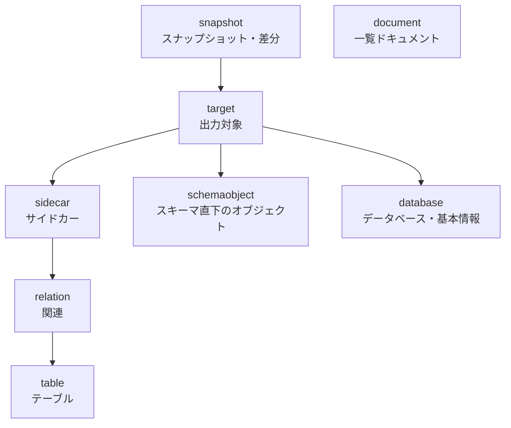
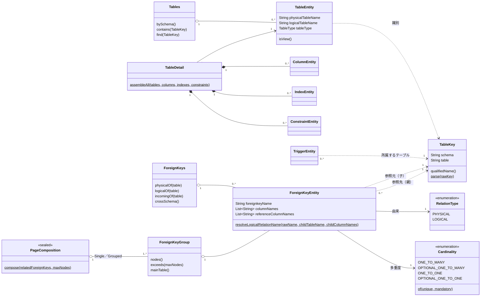
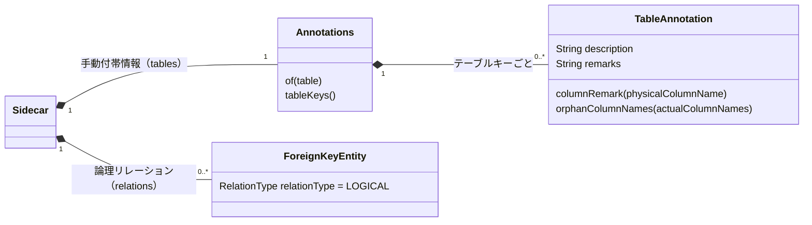
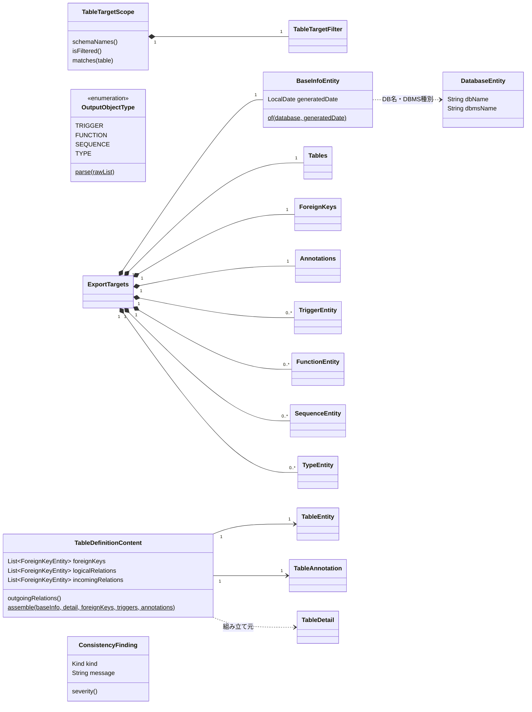

# ドメインモデル

`domain.model` 配下の概念（何を表し、どう関係し、どんなルールを持つか）と、用語（ユビキタス言語）の対応をまとめる。
クラスの一覧は [package-structure.md](./package-structure.md)、処理の流れは [overview.md](./overview.md) を参照。

図には概念の関係・多重度と主なメソッドのみを載せ、全属性・Writer／テンプレート・DIは載せない（陳腐化を避けるため）。
**ドメインの概念（`domain.model`のクラス）を追加・改名・削除したら、この文書の図・ルール表・用語集も更新すること。**

## 前提：このツールのドメイン

DBのカタログ（テーブル・カラム・制約・外部キー等のメタ情報）を読み取り、人が読むドキュメント（テーブル定義書・ER図・各種一覧）と
機械可読なスナップショットへ変換する。あわせて、DBとドキュメント（サイドカーYAML・コミット済みのスナップショット）の乖離を検知する。

DBのメタ情報を**読み取るだけで更新しない**ため、更新の整合性を守る集約やトランザクション境界、状態遷移は持たない。
代わりに次の2点が設計の軸になる。

- **テーブルキー（`TableKey`＝スキーマ名＋物理テーブル名）による紐づけ**：カラム・制約・トリガー・関連・付帯情報は、
  テーブルをオブジェクトとして保持せず、テーブルキーで所属先・参照先のテーブルを指す
- **取得の単位**：テーブル一覧・関連・トリガー等の軽量な情報は対象範囲全体を一括取得し（`ExportTargets`）、
  テーブル数に比例して重くなるカラム・インデックス・制約はスキーマ・チャンク単位で取得して1テーブル分ずつ組み立てる
  （`TableDetail` → `TableDefinitionContent`）。「1テーブル分の出力内容」が組み立て・出力の単位

## 概念のまとまり（パッケージ）

矢印は「依存する側 → 依存される側」（パッケージは`domain.model.{名前}`）。矢印を辿って到達できるパッケージへは
直接依存してよい（例：`target`・`snapshot`は`table`のクラスを直接参照する）が、逆向きの依存や循環は作らない。
`document`（一覧ドキュメントの種別）は他の概念に依存しない。

## テーブルと関連

- **関連（`ForeignKeyEntity`）**は、DBに実在する外部キー制約（`RelationType.PHYSICAL`）と、サイドカーYAMLで宣言した
  論理リレーション（`RelationType.LOGICAL`）の**総称**。両者を1つの集合（`ForeignKeys`）に合流させ、ER図・グループ分割・
  スキーマ跨ぎの抽出を共通に扱う。クラス名の`ForeignKey`は歴史的経緯によるもので、論理リレーションも含む（用語集を参照）
- **多重度（`Cardinality`）**は、参照元（子）の外部キー列の制約から機械的に決まる（`Cardinality.of`）。
  外部キー列がすべてNOT NULLなら親側は「1」、NULLを許容するなら「0..1」。外部キー列が一意制約・一意索引で覆われていれば
  子側は「0..1」、覆われていなければ「0以上」。論理リレーションはDBに制約が無いため、サイドカーでの明示指定か
  既定値（1対多：`Cardinality.DEFAULT_FOR_LOGICAL_RELATION`）を用いる
- **ER図のまとまり（`ForeignKeyGroup`）**は1枚のER図に描く関連の集合。スキーマのノード数が上限（`erDiagramMaxNodes`）を
  超える場合は、関連で繋がったテーブルのまとまり（連結成分）を上限に収まる範囲でまとめ直し、複数ページに分割する
  （`ForeignKeyGroups.compose`が`PageComposition.Single`／`Grouped`を決める）
- 自己参照の関連は、被参照側（`incomingOf`）には含めない（参照側と重複して掲載されるため）
- カラム・インデックス・制約の集合（`Columns`・`Indexes`・`Constraints`）は`TableDetail`の組み立てでのみ使うため
  パッケージプライベートにしている

## サイドカー

- **サイドカー（`Sidecar`）**は、DBから取得できない情報を記述したYAMLの内容。性質の異なる2種類の情報を持つ
  - **手動付帯情報（`Annotations`／`TableAnnotation`）**：テーブル説明・テーブル備考・カラム備考。DBのメタ情報に「文章を足す」もので、
    テーブル定義書の各セルへマージされる
  - **論理リレーション**：DBに外部キー制約が無いテーブル間の関連。「関連という構造を足す」もので、物理外部キーと同じ集合へ合流する
- 付帯情報はテーブルキーで出力対象のテーブルと突き合わせる。対応するテーブル・カラムが実在しないもの（孤児付帯情報）は
  突き合わせの指摘（`ConsistencyFinding`）になる

## 出力対象

- **出力対象の範囲（`TableTargetScope`）**は設定（`schema`・`table`）から入口で1回だけ組み立て、テーブルごとに`matches`で判定する。
  テーブル名パターン（`TableTargetFilter`、パッケージプライベート）はワイルドカード・除外（`!`）・スキーマ修飾に対応し、
  除外が包含より優先される。**出力対象オブジェクト種別（`OutputObjectType`）**は、トリガー・関数等のうちどれを取得・出力するかを決める
- **出力対象（`ExportTargets`）**は対象範囲全体を一括取得した軽量な情報の組。これとチャンク単位で取得した詳細情報
  （`TableDetail`）から、1テーブル分の出力内容（`TableDefinitionContent`）を組み立てる。`TableDefinitionContent`は
  参照側の関連を由来ごと（`foreignKeys`＝物理／`logicalRelations`＝論理）に分けて持ち、被参照側（`incomingRelations`）は由来を分けない
- **突き合わせの指摘（`ConsistencyFinding`）**は、出力対象のテーブルと関連・付帯情報を突き合わせた結果。
  ドメインサービス（`ExportTargetConsistencyDomainService`）が値として返し、ログ等への出力は呼び出し側（アプリケーション層）が
  重要度（`Severity`）に応じて行う
- **基本情報（`BaseInfoEntity`）**は、DBのカタログから取得するデータベースの情報（`DatabaseEntity`）にドキュメントの生成日を
  加えたもの。生成日はDBではなくアプリケーションの時計（`Clock`）で決まる

`FunctionEntity`・`SequenceEntity`・`TypeEntity`（`schemaobject`）はテーブルに属さないため、テーブルキーを持たない。
スナップショット（`snapshot`）は`TableDefinitionContent`等を機械可読な形へ写したもので、図は省略する。

## 主なルールと、それを持つ場所

| ルール | 場所 |
|---|---|
| 「スキーマ.テーブル」形式のキーの解析 | `TableKey.parse` |
| 出力対象の絞り込み（スキーマ名・テーブル名パターン。除外が包含より優先。テーブル名・スキーマ名の部分が空のパターンは設定誤り） | `TableTargetScope` / `TableTargetFilter` |
| 出力対象オブジェクト種別の解釈（未指定なら全種別。未知の種別名は設定誤り） | `OutputObjectType.parse` |
| 多重度の判定・論理リレーションの多重度の既定値 | `Cardinality.of` / `Cardinality.DEFAULT_FOR_LOGICAL_RELATION` |
| 論理リレーションの関連名の自動生成（`{参照元テーブル名}_{列名...}_lrel`） | `ForeignKeyEntity.resolveLogicalRelationName` |
| 関連は参照元・参照先の双方が出力対象のときだけ合流させる（除外した物理外部キーは絞り込み時は指摘しない。論理リレーションは常に指摘する） | `ExportTargetConsistencyDomainService.resolveForeignKeys` |
| 実在しないテーブル・カラムに対する付帯情報の検出（絞り込み時はテーブルの検出を行わない） | `ExportTargetConsistencyDomainService.findOrphan*` / `TableAnnotation.orphanColumnNames` |
| ER図のページ構成（上限に収まらなければ連結成分ごとにまとめ直す） | `ForeignKeyGroups.compose` |
| 一覧ドキュメントは対象が1件以上あるときだけ出力し、関連ドキュメントとしてリンクする（テーブル一覧は常に出力） | `MarkdownExportSinkFactory.listDocuments` |
| Markdownのファイル名・配置・相対リンク（関数・プロシージャのオーバーロードは`{名前}_{番号}`） | `DocumentLocations` |
| スナップショットのファイル名・配置 | `SnapshotLocations` |
| スナップショットの行をオブジェクトとして識別する名前（関数・プロシージャは引数を含む） | `SnapshotKind.identify` |

## 用語集

| 用語 | READMEでの呼び方・設定項目 | コード上の名前 | 説明 |
|---|---|---|---|
| テーブル | テーブル | `TableEntity` | テーブル・ビュー・マテリアライズドビュー（区分は`TableType`） |
| テーブルキー | スキーマ名.テーブル名 | `TableKey` | テーブルの識別子（スキーマ名＋物理テーブル名） |
| 詳細情報 | カラム・インデックス・制約 | `TableDetail` | 1テーブル分のカラム・インデックス・制約。チャンク単位で取得する |
| 関連 | 外部キー・論理リレーション | `ForeignKeyEntity` / `ForeignKeys` | 外部キー（物理）と論理リレーション（論理）の総称。クラス名は歴史的経緯で`ForeignKey` |
| 外部キー | 外部キー | `RelationType.PHYSICAL` | DBに実在する外部キー制約による関連 |
| 論理リレーション | 論理リレーション（`relations`） | `RelationType.LOGICAL` | DBに制約が無く、サイドカーYAMLで宣言した関連 |
| 被参照の関連 | ER図の参照元テーブル | `incomingRelations` / `ForeignKeys.incomingOf` | 自テーブルを参照している関連（物理・論理の双方） |
| 多重度 | 多重度（1対多 等） | `Cardinality` | 関連の両端の件数の関係 |
| グループ | グループ（連結成分のまとまり） | `ForeignKeyGroup` / `ForeignKeyGroups` | 1枚のER図に描く関連の集合と、その分割 |
| スキーマ跨ぎの関連 | スキーマ跨ぎの外部キー | `ForeignKeys.crossSchema` | 参照元と参照先のスキーマが異なる関連 |
| サイドカー | サイドカーYAML（`annotationPath`） | `Sidecar` / `SidecarRepository` | DBから取得できない情報を記述するYAML（手動付帯情報＋論理リレーション）。コード上のパスは`sidecarPath` |
| 手動付帯情報 | 手動付帯情報（`tables`） | `Annotations` / `TableAnnotation` | テーブル説明・テーブル備考・カラム備考 |
| 孤児付帯情報 | 実在しないテーブル・カラムに対する付帯情報 | `ConsistencyFinding.Kind.ORPHAN_*` | リネーム・削除によりDBと乖離した付帯情報 |
| 出力対象の範囲 | `schema`・`table` | `TableTargetScope` / `TableTargetFilter` | 設定から組み立てる絞り込み条件 |
| 出力対象オブジェクト種別 | `outputObjects` | `OutputObjectType` | トリガー・関数/プロシージャ・シーケンス・ユーザー定義型 |
| 出力対象 | － | `ExportTargets` | 対象範囲全体を一括取得する軽量な情報の組 |
| 1テーブル分の出力内容 | テーブル定義書 | `TableDefinitionContent` | テーブル定義書1ファイル・スナップショット1行分の内容 |
| 突き合わせの指摘 | 警告ログ | `ConsistencyFinding` | 出力対象と関連・付帯情報を突き合わせた結果（孤児付帯情報・除外した関連等） |
| 基本情報 | 基本情報（RDBMS・データベース名・作成日） | `BaseInfoEntity` | 各ドキュメントの先頭に掲載する情報。DBの情報（`DatabaseEntity`）＋生成日 |
| スキーマ直下のオブジェクト | 関数・プロシージャ／シーケンス／ユーザー定義型 | `FunctionEntity` / `SequenceEntity` / `TypeEntity` | テーブルに属さないオブジェクト |
| オーバーロード | 同名の関数・プロシージャ | `FunctionEntity.isOverloaded` | 同じスキーマの同名の関数・プロシージャ。個別定義のファイル名に番号を付ける |
| 一覧ドキュメント | テーブル一覧・ER図一覧 等 | `ListDocumentType` | 種別ごとの一覧ページ |
| スナップショット | スキーマのスナップショット | `domain.model.snapshot` | 取得結果を構造化したJSON Lines（生成日を含まない） |
| 差分検知 | `--check`モード | `CheckDocumentDiffUsecase` / `DiffResult` | 生成したスナップショットとコミット済みのスナップショットの比較 |
