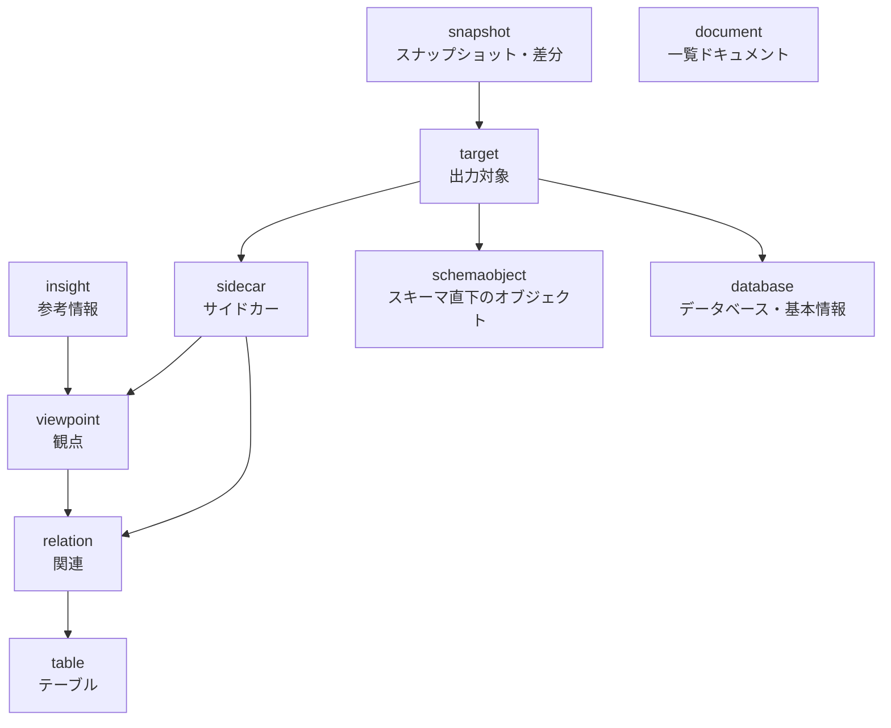
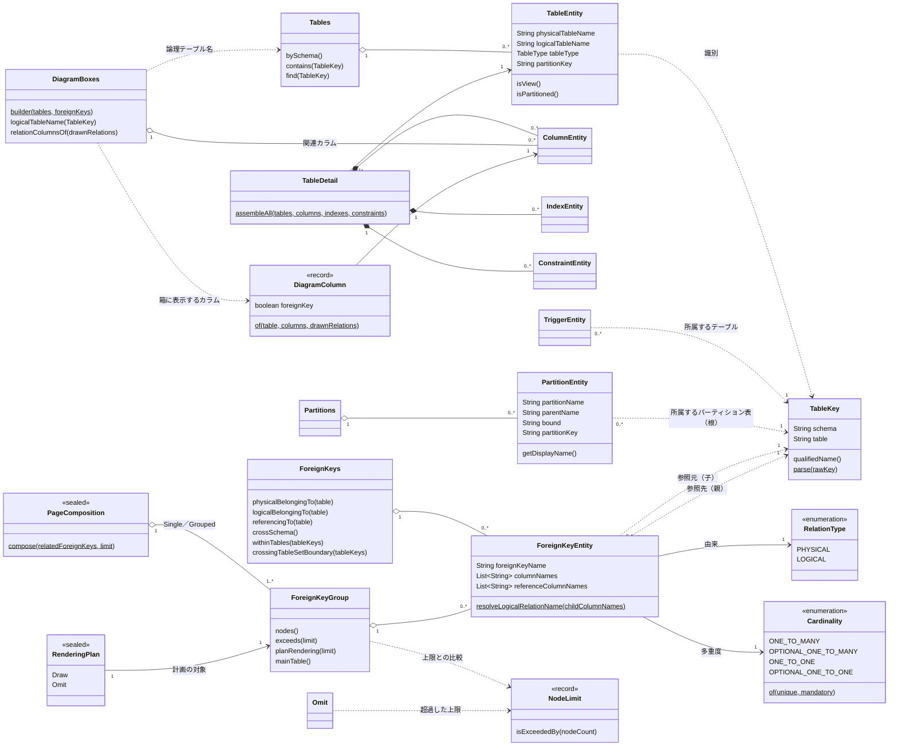
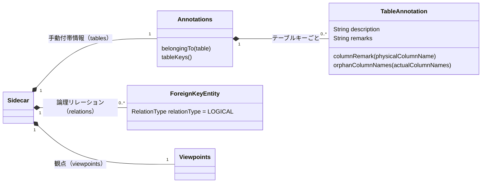
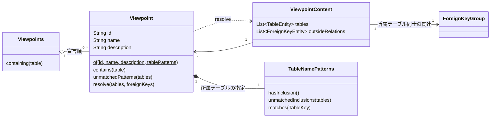
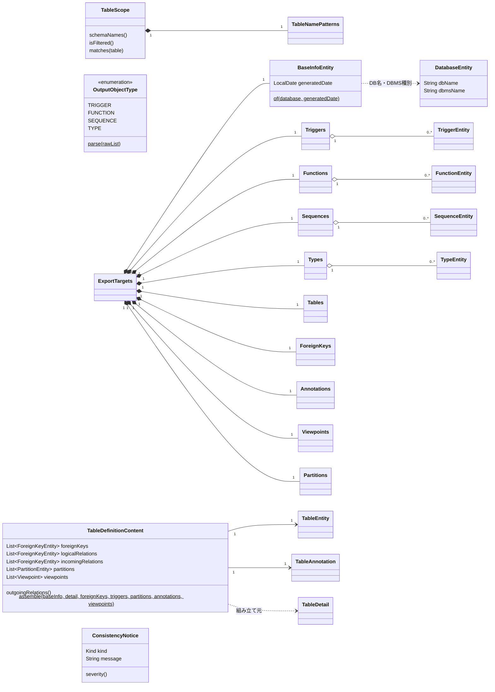

# ドメインモデル

`domain.model` 配下の概念（何を表し、どう関係し、どんなルールを持つか）と、用語（ユビキタス言語）の対応をまとめる。
クラスの一覧は [package-structure.md](./package-structure.md)、処理の流れは [overview.md](./overview.md) を参照。

図には概念の関係・多重度と主なメソッドのみを載せ、全属性・Writer／テンプレート・DIは載せない（陳腐化を避けるため）。
**ドメインの概念（`domain.model`のクラス）を追加・改名・削除したら、この文書の図・ルール表・用語集も更新すること。**

## 前提：このツールのドメイン

DBのカタログ（テーブル・カラム・制約・外部キー等のメタ情報）を読み取り、人が読むドキュメント（テーブル定義書・ER図・各種一覧）と
機械可読なスナップショットへ変換する。あわせて、DBとドキュメント（サイドカーYAML・コミット済みのスナップショット）の乖離を検知する。

DBのメタ情報を**読み取るだけで更新しない**ため、更新の整合性を守る集約やトランザクション境界、状態遷移は持たない。
代わりに次の2点が設計の軸になる。

- **テーブルキー（`TableKey`＝スキーマ名＋物理テーブル名）による紐づけ**：カラム・制約・トリガー・関連・付帯情報は、
  テーブルをオブジェクトとして保持せず、テーブルキーで所属先・参照先のテーブルを指す
- **取得の単位**：テーブル一覧・関連・トリガー等の軽量な情報は対象範囲全体を一括取得し（`ExportTargets`）、
  テーブル数に比例して重くなるカラム・インデックス・制約はスキーマ・チャンク単位で取得して1テーブル分ずつ組み立てる
  （`TableDetail` → `TableDefinitionContent`）。「1テーブル分の出力内容」が組み立て・出力の単位

## 概念のまとまり（パッケージ）

```mermaid
flowchart TB
  snapshot["snapshot<br/>スナップショット・差分"]
  insight["insight<br/>参考情報"]
  target["target<br/>出力対象"]
  sidecar["sidecar<br/>サイドカー"]
  viewpoint["viewpoint<br/>観点"]
  relation["relation<br/>関連"]
  table["table<br/>テーブル"]
  schemaobject["schemaobject<br/>スキーマ直下のオブジェクト"]
  database["database<br/>データベース・基本情報"]
  document["document<br/>一覧ドキュメント"]

  snapshot --> target
  insight --> viewpoint
  target --> sidecar
  target --> schemaobject
  target --> database
  sidecar --> viewpoint
  sidecar --> relation
  viewpoint --> relation
  relation --> table
```

矢印は「依存する側 → 依存される側」（パッケージは`domain.model.{名前}`）。矢印を辿って到達できるパッケージへは
直接依存してよい（例：`target`・`snapshot`は`table`のクラスを直接参照する）が、逆向きの依存や循環は作らない。
`document`（一覧ドキュメントの種別）は他の概念に依存しない。`insight`（参考情報）は`snapshot`とは独立の出力先を持ち、
`snapshot`に依存しない（両者は役割が異なるだけで、互いを経由する関係ではない）。

## テーブルと関連

```mermaid
classDiagram
  direction LR
  class TableKey {
    String schema
    String table
    qualifiedName()
    parse(rawKey)$
  }
  class TableEntity {
    String physicalTableName
    String logicalTableName
    TableType tableType
    String partitionKey
    isView()
    isPartitioned()
  }
  class Tables {
    bySchema()
    contains(TableKey)
    find(TableKey)
  }
  class TableDetail {
    assembleAll(tables, columns, indexes, constraints)$
  }
  class ColumnEntity
  class IndexEntity
  class ConstraintEntity
  class TriggerEntity
  class PartitionEntity {
    String partitionName
    String parentName
    String bound
    String partitionKey
    getDisplayName()
  }
  class Partitions
  class ForeignKeyEntity {
    String foreignKeyName
    List~String~ columnNames
    List~String~ referenceColumnNames
    resolveLogicalRelationName(childColumnNames)$
  }
  class RelationType {
    <<enumeration>>
    PHYSICAL
    LOGICAL
  }
  class Cardinality {
    <<enumeration>>
    ONE_TO_MANY
    OPTIONAL_ONE_TO_MANY
    ONE_TO_ONE
    OPTIONAL_ONE_TO_ONE
    of(unique, mandatory)$
  }
  class ForeignKeys {
    physicalBelongingTo(table)
    logicalBelongingTo(table)
    referencingTo(table)
    crossSchema()
    withinTables(tableKeys)
    crossingTableSetBoundary(tableKeys)
  }
  class ForeignKeyGroup {
    nodes()
    exceeds(limit)
    planRendering(limit)
    mainTable()
  }
  class NodeLimit {
    <<record>>
    isExceededBy(nodeCount)
  }
  class RenderingPlan {
    <<sealed>>
    Draw
    Omit
  }
  class PageComposition {
    <<sealed>>
    compose(relatedForeignKeys, limit)$
  }
  class DiagramBoxes {
    builder(tables, foreignKeys)$
    logicalTableName(TableKey)
    relationColumnsOf(drawnRelations)
  }
  class DiagramColumn {
    <<record>>
    boolean foreignKey
    of(table, columns, drawnRelations)$
  }

  TableEntity ..> TableKey : 識別
  Tables "1" o-- "0..*" TableEntity
  TableDetail "1" --> "1" TableEntity
  TableDetail "1" *-- "0..*" ColumnEntity
  TableDetail "1" *-- "0..*" IndexEntity
  TableDetail "1" *-- "0..*" ConstraintEntity
  TriggerEntity "0..*" ..> "1" TableKey : 所属するテーブル
  PartitionEntity "0..*" ..> "1" TableKey : 所属するパーティション表（根）
  Partitions "1" o-- "0..*" PartitionEntity
  ForeignKeyEntity "0..*" ..> "1" TableKey : 参照元（子）
  ForeignKeyEntity "0..*" ..> "1" TableKey : 参照先（親）
  ForeignKeyEntity --> "1" RelationType : 由来
  ForeignKeyEntity --> "1" Cardinality : 多重度
  ForeignKeys "1" o-- "0..*" ForeignKeyEntity
  ForeignKeyGroup "1" o-- "0..*" ForeignKeyEntity
  PageComposition "1" o-- "1..*" ForeignKeyGroup : Single／Grouped
  ForeignKeyGroup ..> NodeLimit : 上限との比較
  RenderingPlan "1" --> "1" ForeignKeyGroup : 計画の対象
  Omit ..> NodeLimit : 超過した上限
  DiagramBoxes ..> Tables : 論理テーブル名
  DiagramBoxes "1" o-- "0..*" ColumnEntity : 関連カラム
  DiagramBoxes ..> DiagramColumn : 箱に表示するカラム
  DiagramColumn --> "1" ColumnEntity
```

- **関連（`ForeignKeyEntity`）**は、DBに実在する外部キー制約（`RelationType.PHYSICAL`）と、サイドカーYAMLで宣言した
  論理リレーション（`RelationType.LOGICAL`）の**総称**。両者を1つの集合（`ForeignKeys`）に合流させ、ER図・グループ分割・
  スキーマ跨ぎの抽出を共通に扱う。クラス名の`ForeignKey`は歴史的経緯によるもので、論理リレーションも含む（用語集を参照）
- **多重度（`Cardinality`）**は、参照元（子）の外部キー列の制約から機械的に決まる（`Cardinality.of`）。
  外部キー列がすべてNOT NULLなら親側は「1」、NULLを許容するなら「0..1」。外部キー列が一意制約・一意索引で覆われていれば
  子側は「0..1」、覆われていなければ「0以上」。論理リレーションはDBに制約が無いため、サイドカーでの明示指定か
  既定値（1対多：`Cardinality.DEFAULT_FOR_LOGICAL_RELATION`）を用いる
- **ER図のまとまり（`ForeignKeyGroup`）**は1枚のER図に描く関連の集合。スキーマのノード数が上限（`erDiagramMaxNodes`）を
  超える場合は、関連で繋がったテーブルのまとまり（連結成分）を上限に収まる範囲でまとめ直し、複数ページに分割する
  （`ForeignKeyGroups.compose`が`PageComposition.Single`／`Grouped`を決める）
- **描画するか省くか（`RenderingPlan`）**は、1つのまとまりを上限（`NodeLimit`。0以下は上限なし）と比べて
  `Draw`（図を描く）／`Omit`（描画を省略し外部キー一覧にフォールバック）のどちらにするかを表す描き方の計画。
  `ForeignKeyGroup.planRendering`が1回だけ立て、Writer・テンプレートはその結果に従う。規則の全体像は[docs/usage/cli.mdの「ER図の出し分け」](../usage/cli.md#er図の出し分け)を参照
- **テーブルの箱（`DiagramBoxes`）**は、ER図の箱に表示する論理テーブル名と**関連カラム**（関連の参照元・参照先として使われるカラム）を引く。
  カラムはチャンク単位で取得するが、ER図はチャンクより先に書き出すため、関連を持つテーブルのカラムを別途取得し、
  関連カラムだけを残す（`DiagramBoxes.Builder`）。1枚の図の箱には、その図に描く関連で使われるカラムだけを表示し、
  参照元のカラムに`FK`を付ける（`DiagramColumn`）
- **パーティション表**（`TableEntity.isPartitioned()`。宣言的パーティションの親）だけをテーブルとして持ち、子のパーティション
  （多段パーティションの中間・親と別のスキーマに置いたものを含む）は`TableEntity`にしない。子はテーブル一覧・個別の定義書・ER図・
  スナップショットに出さず、パーティション表のテーブル定義書の「パーティション情報」にまとめる。そのため子は`PartitionEntity`として、
  所属するパーティション表（根）のテーブルキーで引く（`Partitions`。トリガーと同じく対象範囲全体を一括取得する）。
  パーティション表のパーティションキーは`TableEntity.partitionKey`が持つ（パーティション表でなければ空文字）。
  親から子へ複製された外部キー・トリガーは取得時に除き、親に定義されたものだけを関連・トリガーとして扱う
- 自己参照の関連は、被参照側（`referencingTo`）には含めない（参照側と重複して掲載されるため）
- カラム・インデックス・制約の集合（`Columns`・`Indexes`・`Constraints`）は`TableDetail`の組み立てでのみ使うため
  パッケージプライベートにしている

## サイドカー

```mermaid
classDiagram
  direction LR
  class Sidecar
  class Annotations {
    belongingTo(table)
    tableKeys()
  }
  class TableAnnotation {
    String description
    String remarks
    columnRemark(physicalColumnName)
    orphanColumnNames(actualColumnNames)
  }
  class ForeignKeyEntity {
    RelationType relationType = LOGICAL
  }

  class Viewpoints

  Sidecar "1" *-- "1" Annotations : 手動付帯情報（tables）
  Sidecar "1" *-- "0..*" ForeignKeyEntity : 論理リレーション（relations）
  Sidecar "1" *-- "1" Viewpoints : 観点（viewpoints）
  Annotations "1" *-- "0..*" TableAnnotation : テーブルキーごと
```

- **サイドカー（`Sidecar`）**は、DBから取得できない情報を記述したYAMLの内容。性質の異なる3種類の情報を持つ
  - **手動付帯情報（`Annotations`／`TableAnnotation`）**：テーブル説明・テーブル備考・カラム備考。DBのメタ情報に「文章を足す」もので、
    テーブル定義書の各セルへマージされる
  - **論理リレーション**：DBに外部キー制約が無いテーブル間の関連。「関連という構造を足す」もので、物理外部キーと同じ集合へ合流する
  - **観点（`Viewpoints`）**：業務ドメイン別にテーブルをまとめる切り口。「読む単位を足す」もので、観点ごとのページになる（次節）
- 付帯情報はテーブルキーで出力対象のテーブルと突き合わせる。対応するテーブル・カラムが実在しないもの（孤児付帯情報）は
  突き合わせの通知（`ConsistencyNotice`）になる

## 観点

```mermaid
classDiagram
  direction LR
  class Viewpoint {
    String id
    String name
    String description
    of(id, name, description, tablePatterns)$
    contains(table)
    unmatchedPatterns(tables)
    resolve(tables, foreignKeys)
  }
  class Viewpoints {
    containing(table)
  }
  class ViewpointContent {
    List~TableEntity~ tables
    List~ForeignKeyEntity~ outsideRelations
  }
  class TableNamePatterns {
    hasInclusion()
    unmatchedInclusions(tables)
    matches(TableKey)
  }

  Viewpoints "1" o-- "0..*" Viewpoint : 宣言順
  Viewpoint "1" *-- "1" TableNamePatterns : 所属テーブルの指定
  Viewpoint ..> ViewpointContent : resolve
  ViewpointContent "1" --> "1" Viewpoint
  ViewpointContent "1" --> "1" ForeignKeyGroup : 所属テーブル同士の関連
```

- **観点（`Viewpoint`）**は、スキーマ・連結成分（グループ）による機械的なまとまりとは別に、人が読む単位でテーブルを束ねたもの。
  所属テーブルは出力対象の範囲（`table=`）と同じテーブル名パターン（`TableNamePatterns`）で指定し、包含パターンが1件以上必要
  （除外パターンだけでは全テーブルが所属してしまうため）
- **識別子（`id`）**は観点ページのファイル名に使うため、英数字・`-`・`_`に限る。表示名（`name`）は省略すると識別子になる
- **1観点分の出力内容（`ViewpointContent`）**は、出力対象のテーブル・関連から`Viewpoint.resolve`で求める。所属テーブル同士の関連
  （両端が所属）はER図に描き、片端だけが所属する関連は「観点外のテーブルとの関連」として一覧にする
- 1つのテーブルが複数の観点に所属してよい。テーブルから所属する観点は`Viewpoints.containing(table)`で逆引きし、
  1テーブル分の出力内容（`TableDefinitionContent.viewpoints`）に持たせる
- 観点は見せ方でありスキーマではないため、スナップショットには含めない

## 出力対象

```mermaid
classDiagram
  direction LR
  class TableScope {
    schemaNames()
    isFiltered()
    matches(table)
  }
  class TableNamePatterns
  class OutputObjectType {
    <<enumeration>>
    TRIGGER
    FUNCTION
    SEQUENCE
    TYPE
    parse(rawList)$
  }
  class ExportTargets
  class Triggers
  class Functions
  class Sequences
  class Types
  class TableDefinitionContent {
    List~ForeignKeyEntity~ foreignKeys
    List~ForeignKeyEntity~ logicalRelations
    List~ForeignKeyEntity~ incomingRelations
    List~PartitionEntity~ partitions
    List~Viewpoint~ viewpoints
    outgoingRelations()
    assemble(baseInfo, detail, foreignKeys, triggers, partitions, annotations, viewpoints)$
  }
  class BaseInfoEntity {
    LocalDate generatedDate
    of(database, generatedDate)$
  }
  class DatabaseEntity {
    String dbName
    String dbmsName
  }
  class ConsistencyNotice {
    Kind kind
    String message
    severity()
  }

  TableScope "1" *-- "1" TableNamePatterns
  ExportTargets "1" *-- "1" BaseInfoEntity
  ExportTargets "1" *-- "1" Tables
  ExportTargets "1" *-- "1" ForeignKeys
  ExportTargets "1" *-- "1" Annotations
  ExportTargets "1" *-- "1" Viewpoints
  ExportTargets "1" *-- "1" Triggers
  ExportTargets "1" *-- "1" Partitions
  ExportTargets "1" *-- "1" Functions
  ExportTargets "1" *-- "1" Sequences
  ExportTargets "1" *-- "1" Types
  Triggers "1" o-- "0..*" TriggerEntity
  Functions "1" o-- "0..*" FunctionEntity
  Sequences "1" o-- "0..*" SequenceEntity
  Types "1" o-- "0..*" TypeEntity
  BaseInfoEntity ..> DatabaseEntity : DB名・DBMS種別
  TableDefinitionContent "1" --> "1" TableEntity
  TableDefinitionContent "1" --> "1" TableAnnotation
  TableDefinitionContent ..> TableDetail : 組み立て元
```

- **出力対象の範囲（`TableScope`）**は設定（`schema`・`table`）から入口で1回だけ組み立て、テーブルごとに`matches`で判定する。
  テーブル名パターン（`TableNamePatterns`。観点の所属テーブルの指定と共有するため`table`に置く）はワイルドカード・除外（`!`）・スキーマ修飾に対応し、
  除外が包含より優先される。**出力対象オブジェクト種別（`OutputObjectType`）**は、トリガー・関数等のうちどれを取得・出力するかを決める
- **出力対象（`ExportTargets`）**は対象範囲全体を一括取得した軽量な情報の組。これとチャンク単位で取得した詳細情報
  （`TableDetail`）から、1テーブル分の出力内容（`TableDefinitionContent`）を組み立てる。`TableDefinitionContent`は
  参照側の関連を由来ごと（`foreignKeys`＝物理／`logicalRelations`＝論理）に分けて持ち、被参照側（`incomingRelations`）は由来を分けない（定義書の「被参照情報」セクションとER図に使い、由来は「区分」列・線種で示す）
- **突き合わせの通知（`ConsistencyNotice`）**は、出力対象のテーブルと関連・付帯情報・観点を突き合わせた結果。
  ドメインサービス（`ExportTargetConsistency`）が値として返し、ログ等への出力は呼び出し側（アプリケーション層）が
  重要度（`Severity`）に応じて行う
- **基本情報（`BaseInfoEntity`）**は、DBのカタログから取得するデータベースの情報（`DatabaseEntity`）にドキュメントの生成日を
  加えたもの。生成日はDBではなくアプリケーションの時計（`Clock`）で決まる

`FunctionEntity`・`SequenceEntity`・`TypeEntity`（`schemaobject`）はテーブルに属さないため、テーブルキーを持たない。
そのため、それぞれの集合（`Functions`・`Sequences`・`Types`）はテーブルキーでの索引を持たず、取得順のリストだけを保持する
（トリガーは所属テーブルで引くため、`Triggers`は`AbstractEntities`を継承してテーブルキーの索引も持つ）。
スナップショット（`snapshot`）は`TableDefinitionContent`等を機械可読な形へ写したもので、図は省略する。

参考情報（`insight`）は、スナップショットの事実とは別にAIへ渡す情報（観点等。`--check`の比較対象ではない）を
機械可読な形へ写したもので、`snapshot`と対になる出力だが依存しない。現時点の内容は`ViewpointsInsight`
（1ファイル分。`formatVersion`を持つ）／`ViewpointInsight`（観点1件。識別子・表示名・説明・所属テーブル）のみで、
`Viewpoint.resolve`の結果（`ViewpointContent`）から変換する。図は省略する。

## 主なルールと、それを持つ場所

| ルール | 場所 |
|---|---|
| 「スキーマ.テーブル」形式のキーの解析 | `TableKey.parse` |
| 出力対象の絞り込み（スキーマ名・テーブル名パターン。除外が包含より優先。テーブル名・スキーマ名の部分が空のパターンは設定誤り） | `TableScope` / `TableNamePatterns` |
| 出力対象オブジェクト種別の解釈（未指定なら全種別。未知の種別名は設定誤り） | `OutputObjectType.parse` |
| 子のパーティションはテーブルに含めない・親から複製された外部キー（`conparentid`）・トリガー（`tgparentid`）は取得しない（PostgreSQL 13以上） | `tableDefinitionMapper.xml`（PostgreSQL）の`selectTableInfo`・`selectConstraintInfo`・`selectForeignKeyInfo`・`selectTriggerInfo` |
| パーティション表の判定、パーティションの名前を根のスキーマからの相対で表す規則 | `TableEntity.isPartitioned` / `PartitionEntity.getDisplayName` |
| パーティション表のパーティションを、親から子へ階層順に取得する | `tableDefinitionMapper.xml`（PostgreSQL）の`selectPartitionInfo`（再帰CTE） |
| 多重度の判定・論理リレーションの多重度の既定値 | `Cardinality.of` / `Cardinality.DEFAULT_FOR_LOGICAL_RELATION` |
| 論理リレーションの関連名の自動生成（`{列名...}`） | `ForeignKeyEntity.resolveLogicalRelationName` |
| 関連は参照元・参照先の双方が出力対象のときだけ合流させる（除外した物理外部キーは絞り込み時は通知しない。論理リレーションは常に通知する） | `ExportTargetConsistency.resolveForeignKeys` |
| 実在しないテーブル・カラムに対する付帯情報の検出（絞り込み時はテーブルの検出を行わない） | `ExportTargetConsistency.findOrphan*` / `TableAnnotation.orphanColumnNames` |
| 観点の識別子の形式（英数字・`-`・`_`）・所属テーブルの包含パターンが必須・表示名の既定値（識別子） | `Viewpoint.of` |
| 観点の所属テーブルと、所属テーブル同士の関連・観点外のテーブルとの関連の求め方 | `Viewpoint.resolve` / `ForeignKeys.withinTables` / `ForeignKeys.crossingTableSetBoundary` |
| どのテーブルにも一致しない観点のパターンの検出（絞り込み時は検出を行わない） | `ExportTargetConsistency.findUnmatchedViewpointPatterns` / `TableNamePatterns.unmatchedInclusions` |
| ER図のページ構成（上限に収まらなければ連結成分ごとにまとめ直す） | `ForeignKeyGroups.compose` |
| ER図を描くか、描画を省略して外部キー一覧にフォールバックするか | `ForeignKeyGroup.planRendering` / `NodeLimit.isExceededBy` |
| ER図の箱に表示するカラム（図に描く関連で使われる関連カラムのみ。参照元のカラムは`FK`） | `DiagramBoxes.relationColumnsOf` / `DiagramColumn.of` |
| 一覧ドキュメント（観点一覧を含む）は対象が1件以上あるときだけ出力し、関連ドキュメントとしてリンクする（テーブル一覧は常に出力） | `MarkdownExportSinkFactory.listDocuments` |
| Markdownのファイル名・配置・相対リンク（関数・プロシージャのオーバーロードは`{名前}_{番号}`、観点ページは識別子から`viewpoint_{DB名}_{識別子}`） | `DocumentLocations` |
| スナップショットのファイル名・配置 | `SnapshotLocations` |
| 参考情報のファイル名・配置（`snapshot`の兄弟。`--check`の対象外） | `InsightLocations` |
| スナップショットの行をオブジェクトとして識別する名前（関数・プロシージャは引数を含む） | `SnapshotKind.identify` |

## 用語集

「出力対象」は取得した出力するもの（データ。`ExportTargets`）を指し、何を出力するかの条件は「出力対象の絞り込み条件」と呼んで区別する。

| 用語 | 利用者向けのドキュメントでの呼び方・設定項目 | コード上の名前 | 説明 |
|---|---|---|---|
| テーブル | テーブル | `TableEntity` | テーブル・ビュー・マテリアライズドビュー（区分は`TableType`） |
| テーブルキー | スキーマ名.テーブル名 | `TableKey` | テーブルの識別子（スキーマ名＋物理テーブル名） |
| 詳細情報 | カラム・インデックス・制約 | `TableDetail` | 1テーブル分のカラム・インデックス・制約。チャンク単位で取得する |
| パーティション表 | パーティション表（`PARTITION BY`） | `TableEntity.isPartitioned` / `TableEntity.partitionKey` | パーティションの親（PostgreSQLの宣言的パーティション・Oracleのパーティション表）。テーブルとして出力し、パーティションキーを持つ |
| パーティション | パーティション（子のパーティション） | `PartitionEntity` / `Partitions` | パーティション表の下位のテーブル（多段パーティションの中間を含む）。テーブルとして出力せず、パーティション表の定義書の「パーティション情報」にまとめる |
| 関連 | 外部キー・論理リレーション | `ForeignKeyEntity` / `ForeignKeys` | 外部キー（物理）と論理リレーション（論理）の総称。クラス名は歴史的経緯で`ForeignKey` |
| 外部キー | 外部キー | `RelationType.PHYSICAL` | DBに実在する外部キー制約による関連 |
| 論理リレーション | 論理リレーション（`relations`） | `RelationType.LOGICAL` | DBに制約が無く、サイドカーYAMLで宣言した関連 |
| 被参照の関連 | 被参照情報・ER図の参照元テーブル | `incomingRelations` / `ForeignKeys.referencingTo` | 自テーブルを参照している関連（物理・論理の双方） |
| 多重度 | 多重度（1対多 等） | `Cardinality` | 関連の両端の件数の関係 |
| グループ | グループ（連結成分のまとまり） | `ForeignKeyGroup` / `ForeignKeyGroups` | 1枚のER図に描く関連の集合と、その分割 |
| テーブルの箱 | ER図のテーブルの箱 | `DiagramBoxes` / `DiagramColumn` | ER図に描くテーブルの表示内容（`テーブル名（論理テーブル名）`の見出しと、表示するカラム） |
| 関連カラム | 関連をつなぐカラム | `DiagramBoxes.relationColumnsOf` | 関連の参照元・参照先として使われるカラム。ER図の箱に表示する |
| スキーマ跨ぎの関連 | スキーマ跨ぎの外部キー | `ForeignKeys.crossSchema` | 参照元と参照先のスキーマが異なる関連 |
| サイドカー | サイドカーYAML（`annotations`） | `Sidecar` / `SidecarRepository` | DBから取得できない情報を記述するYAML（手動付帯情報＋論理リレーション＋観点）。コード上のパスは`sidecarPath` |
| 手動付帯情報 | 手動付帯情報（`tables`） | `Annotations` / `TableAnnotation` | テーブル説明・テーブル備考・カラム備考 |
| 孤児付帯情報 | 実在しないテーブル・カラムに対する付帯情報 | `ConsistencyNotice.Kind.ORPHAN_*` | リネーム・削除によりDBと乖離した付帯情報 |
| 出力対象の絞り込み条件 | `target`（`schemas`・`tables`・`objects`） | `TargetSelection`（`application`） | 何を出力するかの条件。出力対象の範囲（`TableScope`）＋出力対象オブジェクト種別（`OutputObjectType`）。サイドカーYAMLのパスは条件ではなく入力元のため含めず、要求（`ExportTableDefinitionRequest`・`CheckDocumentDiffRequest`）が別に持つ |
| 出力対象の範囲 | `schema`・`table` | `TableScope` | 出力対象の絞り込み条件のうち、テーブルを対象とするもの（スキーマ名＋テーブル名パターン） |
| テーブル名パターン | `table`の記法（ワイルドカード・除外・スキーマ修飾） | `TableNamePatterns` | 出力対象の範囲と観点の所属テーブルの指定で共通の記法 |
| 観点 | 観点（`viewpoints`） | `Viewpoint` / `Viewpoints` | 業務ドメイン別にテーブルをまとめる切り口。観点ごとのページと観点一覧を出力する |
| 所属テーブル | 観点の所属テーブル | `ViewpointContent.tables` / `Viewpoint.contains` | 観点に含まれるテーブル |
| 観点外のテーブルとの関連 | 観点外のテーブルとの関連 | `ViewpointContent.outsideRelations` / `ForeignKeys.crossingTableSetBoundary` | 片端だけが所属テーブルの関連 |
| 出力対象オブジェクト種別 | `target.objects` | `OutputObjectType` | 出力対象の絞り込み条件のうち、テーブル以外の追加オブジェクトを対象とするもの。トリガー・関数/プロシージャ・シーケンス・ユーザー定義型（トリガーはテーブルに属するため、スキーマ直下のオブジェクトとは範囲が異なる） |
| 出力対象 | － | `ExportTargets` | 出力対象の絞り込み条件を適用して取得した、出力するもの（条件ではなくデータ）。コード上は対象範囲全体を一括取得する軽量な情報の組を指す |
| 1テーブル分の出力内容 | テーブル定義書 | `TableDefinitionContent` | テーブル定義書1ファイル・スナップショット1行分の内容 |
| 突き合わせの通知 | 警告ログ | `ConsistencyNotice` | 出力対象と関連・付帯情報・観点を突き合わせた結果（孤児付帯情報・除外した関連・一致しない観点のパターン等） |
| 基本情報 | 基本情報（RDBMS・データベース名・作成日） | `BaseInfoEntity` | 各ドキュメントの先頭に掲載する情報。DBの情報（`DatabaseEntity`）＋生成日 |
| スキーマ直下のオブジェクト | 関数・プロシージャ／シーケンス／ユーザー定義型 | `FunctionEntity` / `SequenceEntity` / `TypeEntity` | テーブルに属さないオブジェクト |
| オーバーロード | 同名の関数・プロシージャ | `FunctionEntity.isOverloaded` | 同じスキーマの同名の関数・プロシージャ。個別定義のファイル名に番号を付ける |
| 一覧ドキュメント | テーブル一覧・ER図一覧・観点一覧 等 | `ListDocumentType` | 種別ごとの一覧ページ |
| スナップショット | スキーマのスナップショット | `domain.model.snapshot` | 取得結果を構造化したJSON Lines（生成日を含まない） |
| 差分検知 | `--check`モード | `CheckDocumentDiffUsecase` / `DiffResult` | 生成したスナップショットとコミット済みのスナップショットの比較 |
| 参考情報 | 参考情報（`insights/`） | `domain.model.insight` | スナップショットの事実とは別にAIへ渡す情報（観点等）。`--check`の比較対象ではなく、`snapshot`の兄弟ディレクトリに出力する |
