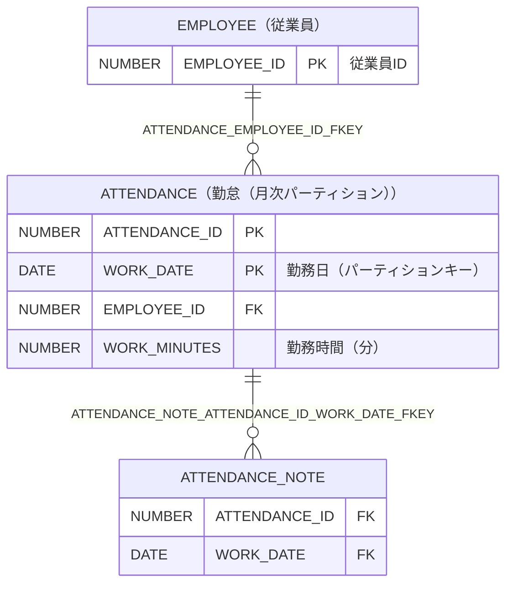

# ATTENDANCE（勤怠（月次パーティション））

## 基本情報

| RDBMS | データベース名 | 作成日 |
|:---|:---|:---|
|Oracle|FREEPDB1|2026/10/04|

## テーブル説明

## テーブル情報

| スキーマ名 | 論理テーブル名 | 物理テーブル名 | 区分 | 備考 |
|:---|:---|:---|:---|:---|
|SAMPLE|勤怠（月次パーティション）|ATTENDANCE|table||

## カラム情報

| No. | 論理名 | 物理名 | データ型 | 桁数/精度 | PK | Not Null | デフォルト | 備考 |
|:---|:---|:---|:---|:---|:---|:---|:---|:---|
|1||ATTENDANCE_ID|NUMBER(19,0)|19|○|○|||
|2|勤務日（パーティションキー）|WORK_DATE|DATE||○|○|||
|3||EMPLOYEE_ID|NUMBER(10,0)|10||○|||
|4|勤務時間（分）|WORK_MINUTES|NUMBER(*,0)||||||

## パーティション情報

パーティションキー: `RANGE (WORK_DATE)`

| No. | パーティション | 親 | パーティション境界 | 下位のパーティションキー |
|:---|:---|:---|:---|:---|
|1|ATTENDANCE_2025|ATTENDANCE|VALUES LESS THAN (TO_DATE(' 2026-01-01 00:00:00', 'SYYYY-MM-DD HH24:MI:SS', 'NLS_CALENDAR=GREGORIAN'))||
|2|ATTENDANCE_2026_01|ATTENDANCE|VALUES LESS THAN (TO_DATE(' 2026-02-01 00:00:00', 'SYYYY-MM-DD HH24:MI:SS', 'NLS_CALENDAR=GREGORIAN'))||
|3|ATTENDANCE_2026_02|ATTENDANCE|VALUES LESS THAN (TO_DATE(' 2026-03-01 00:00:00', 'SYYYY-MM-DD HH24:MI:SS', 'NLS_CALENDAR=GREGORIAN'))||
|4|ATTENDANCE_2026_03|ATTENDANCE|VALUES LESS THAN (TO_DATE(' 2026-04-01 00:00:00', 'SYYYY-MM-DD HH24:MI:SS', 'NLS_CALENDAR=GREGORIAN'))||
|5|ATTENDANCE_DEFAULT|ATTENDANCE|VALUES LESS THAN (MAXVALUE)||

## インデックス情報

| No. | インデックス名 | 種別 | UNIQUE | PRIMARY | 定義 | 備考 |
|:---|:---|:---|:---|:---|:---|:---|
|1|ATTENDANCE_PKEY|NORMAL|○|○|CREATE UNIQUE INDEX ATTENDANCE_PKEY ON ATTENDANCE (ATTENDANCE_ID,WORK_DATE)||
|2|IDX_ATTENDANCE_EMPLOYEE|NORMAL|||CREATE INDEX IDX_ATTENDANCE_EMPLOYEE ON ATTENDANCE (EMPLOYEE_ID)||

## 制約情報

| No. | 制約名 | 種類 | 制約定義 | 備考 |
|:---|:---|:---|:---|:---|
|1|ATTENDANCE_EMPLOYEE_ID_FKEY|FOREIGN KEY|FOREIGN KEY (EMPLOYEE_ID) REFERENCES EMPLOYEE(EMPLOYEE_ID)||
|2|ATTENDANCE_PKEY|PRIMARY KEY|PRIMARY KEY (ATTENDANCE_ID,WORK_DATE)||

## 外部キー情報

| No. | 外部キー名 | カラムリスト | 参照先 | 参照先カラムリスト | 多重度 |
|:---|:---|:---|:---|:---|:---|
|1|ATTENDANCE_EMPLOYEE_ID_FKEY|EMPLOYEE_ID|SAMPLE.EMPLOYEE|EMPLOYEE_ID|1対多|

## 被参照情報

| No. | 参照元 | 参照元カラムリスト | 参照されるカラムリスト | 関連名 | 多重度 | 区分 |
|:---|:---|:---|:---|:---|:---|:---|
|1|SAMPLE.ATTENDANCE_NOTE|ATTENDANCE_ID,WORK_DATE|ATTENDANCE_ID,WORK_DATE|ATTENDANCE_NOTE_ATTENDANCE_ID_WORK_DATE_FKEY|1対多|物理|

## トリガー情報

| No. | トリガー名 | タイミング | イベント | 単位 | 定義 |
|:---|:---|:---|:---|:---|:---|
|1|TRG_ATTENDANCE_CHECK_WORK_MINUTES|BEFORE|INSERT/UPDATE|ROW|CREATE OR REPLACE TRIGGER sample.trg_attendance_check_work_minutes before insert or update on sample.attendance for each row|

## ER図

___

[テーブル一覧へ](../../tableList_FREEPDB1.md)
