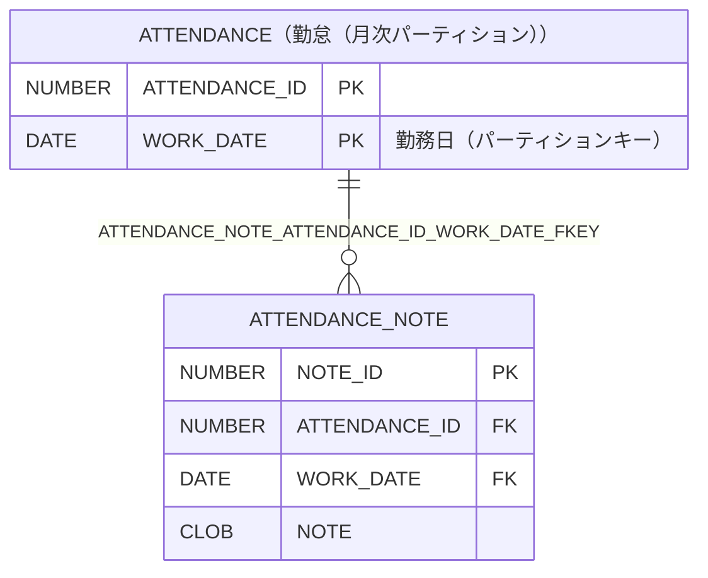

# ATTENDANCE_NOTE

## 基本情報

| RDBMS | データベース名 | 作成日 |
|:---|:---|:---|
|Oracle|FREEPDB1|2026/10/04|

## テーブル説明

## テーブル情報

| スキーマ名 | 論理テーブル名 | 物理テーブル名 | 区分 | 備考 |
|:---|:---|:---|:---|:---|
|SAMPLE||ATTENDANCE_NOTE|table||

## カラム情報

| No. | 論理名 | 物理名 | データ型 | 桁数/精度 | PK | Not Null | デフォルト | 備考 |
|:---|:---|:---|:---|:---|:---|:---|:---|:---|
|1||NOTE_ID|NUMBER(10,0)|10|○|○|||
|2||ATTENDANCE_ID|NUMBER(19,0)|19||○|||
|3||WORK_DATE|DATE|||○|||
|4||NOTE|CLOB||||||

## インデックス情報

| No. | インデックス名 | 種別 | UNIQUE | PRIMARY | 定義 | 備考 |
|:---|:---|:---|:---|:---|:---|:---|
|1|ATTENDANCE_NOTE_PKEY|NORMAL|○|○|CREATE UNIQUE INDEX ATTENDANCE_NOTE_PKEY ON ATTENDANCE_NOTE (NOTE_ID)||

## 制約情報

| No. | 制約名 | 種類 | 制約定義 | 備考 |
|:---|:---|:---|:---|:---|
|1|ATTENDANCE_NOTE_ATTENDANCE_ID_WORK_DATE_FKEY|FOREIGN KEY|FOREIGN KEY (ATTENDANCE_ID,WORK_DATE) REFERENCES ATTENDANCE(ATTENDANCE_ID,WORK_DATE)||
|2|ATTENDANCE_NOTE_PKEY|PRIMARY KEY|PRIMARY KEY (NOTE_ID)||

## 外部キー情報

| No. | 外部キー名 | カラムリスト | 参照先 | 参照先カラムリスト | 多重度 |
|:---|:---|:---|:---|:---|:---|
|1|ATTENDANCE_NOTE_ATTENDANCE_ID_WORK_DATE_FKEY|ATTENDANCE_ID,WORK_DATE|SAMPLE.ATTENDANCE|ATTENDANCE_ID,WORK_DATE|1対多|

## トリガー情報

| No. | トリガー名 | タイミング | イベント | 単位 | 定義 |
|:---|:---|:---|:---|:---|:---|

## ER図

___

[テーブル一覧へ](../../tableList_FREEPDB1.md)
