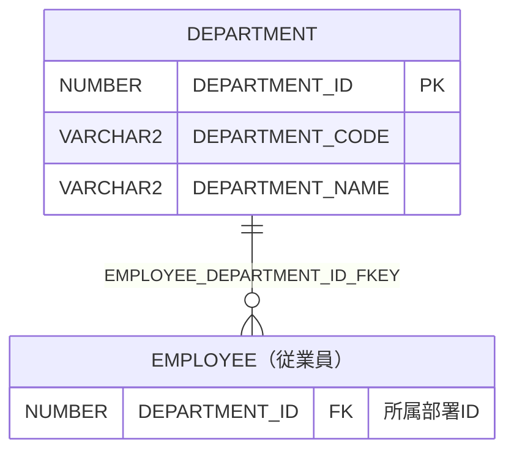

# DEPARTMENT

## 基本情報

| RDBMS | データベース名 | 作成日 |
|:---|:---|:---|
|Oracle|FREEPDB1|2026/10/04|

## テーブル説明

## テーブル情報

| スキーマ名 | 論理テーブル名 | 物理テーブル名 | 区分 | 備考 |
|:---|:---|:---|:---|:---|
|SAMPLE||DEPARTMENT|table||

## カラム情報

| No. | 論理名 | 物理名 | データ型 | 桁数/精度 | PK | Not Null | デフォルト | 備考 |
|:---|:---|:---|:---|:---|:---|:---|:---|:---|
|1||DEPARTMENT_ID|NUMBER(10,0)|10|○|○|GENERATED BY DEFAULT AS IDENTITY||
|2||DEPARTMENT_CODE|VARCHAR2(10)|10||○|||
|3||DEPARTMENT_NAME|VARCHAR2(50)|50||○|||

## インデックス情報

| No. | インデックス名 | 種別 | UNIQUE | PRIMARY | 定義 | 備考 |
|:---|:---|:---|:---|:---|:---|:---|
|1|DEPARTMENT_DEPARTMENT_CODE_KEY|NORMAL|○||CREATE UNIQUE INDEX DEPARTMENT_DEPARTMENT_CODE_KEY ON DEPARTMENT (DEPARTMENT_CODE)||
|2|DEPARTMENT_PKEY|NORMAL|○|○|CREATE UNIQUE INDEX DEPARTMENT_PKEY ON DEPARTMENT (DEPARTMENT_ID)||

## 制約情報

| No. | 制約名 | 種類 | 制約定義 | 備考 |
|:---|:---|:---|:---|:---|
|1|DEPARTMENT_PKEY|PRIMARY KEY|PRIMARY KEY (DEPARTMENT_ID)||
|2|DEPARTMENT_DEPARTMENT_CODE_KEY|UNIQUE|UNIQUE (DEPARTMENT_CODE)||

## 外部キー情報

| No. | 外部キー名 | カラムリスト | 参照先 | 参照先カラムリスト | 多重度 |
|:---|:---|:---|:---|:---|:---|

## 被参照情報

| No. | 参照元 | 参照元カラムリスト | 参照されるカラムリスト | 関連名 | 多重度 | 区分 |
|:---|:---|:---|:---|:---|:---|:---|
|1|SAMPLE.EMPLOYEE|DEPARTMENT_ID|DEPARTMENT_ID|EMPLOYEE_DEPARTMENT_ID_FKEY|1対多|物理|

## トリガー情報

| No. | トリガー名 | タイミング | イベント | 単位 | 定義 |
|:---|:---|:---|:---|:---|:---|

## ER図

___

[テーブル一覧へ](../../tableList_FREEPDB1.md)
