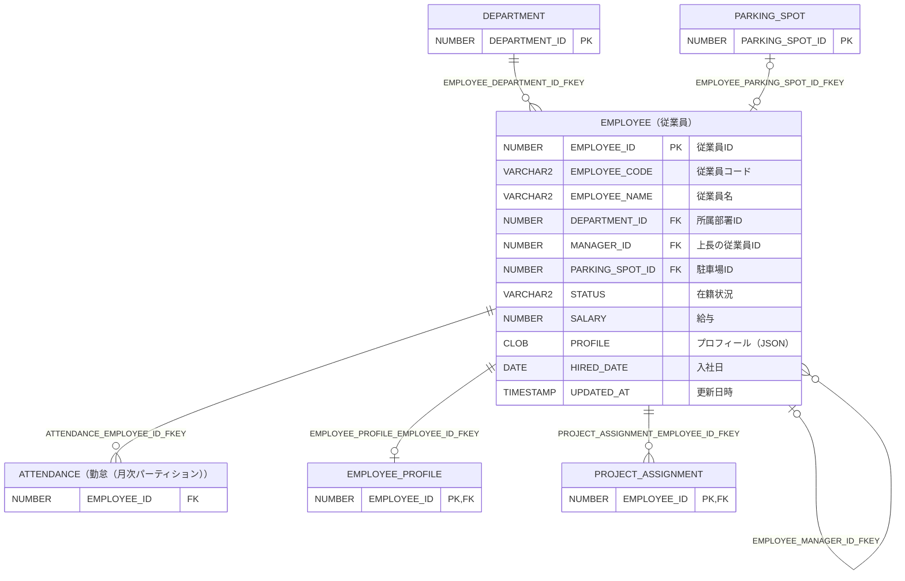

# EMPLOYEE（従業員）

## 基本情報

| RDBMS | データベース名 | 作成日 |
|:---|:---|:---|
|Oracle 23|FREEPDB1|2026/10/10|

## テーブル説明

## テーブル情報

| スキーマ名 | 論理テーブル名 | 物理テーブル名 | 区分 | 備考 |
|:---|:---|:---|:---|:---|
|SAMPLE|従業員|EMPLOYEE|table||

## カラム情報

| No. | 論理名 | 物理名 | データ型 | 桁数/精度 | PK | Not Null | デフォルト | 備考 |
|:---|:---|:---|:---|:---|:---|:---|:---|:---|
|1|従業員ID|EMPLOYEE_ID|NUMBER(10,0)|10|○|○|GENERATED BY DEFAULT AS IDENTITY||
|2|従業員コード|EMPLOYEE_CODE|VARCHAR2(10)|10||○|||
|3|従業員名|EMPLOYEE_NAME|VARCHAR2(50)|50||○|||
|4|所属部署ID|DEPARTMENT_ID|NUMBER(10,0)|10||○|||
|5|上長の従業員ID|MANAGER_ID|NUMBER(10,0)|10|||||
|6|駐車場ID|PARKING_SPOT_ID|NUMBER(10,0)|10|||||
|7|在籍状況|STATUS|VARCHAR2(10)|10||○|'ACTIVE'||
|8|給与|SALARY|NUMBER(10,2)|10,2||○|0||
|9|プロフィール（JSON）|PROFILE|CLOB|||○|'{}'||
|10|入社日|HIRED_DATE|DATE|||○|trunc(sysdate)||
|11|更新日時|UPDATED_AT|TIMESTAMP(6)|||○|systimestamp||

## インデックス情報

| No. | インデックス名 | 種別 | UNIQUE | PRIMARY | 定義 | 備考 |
|:---|:---|:---|:---|:---|:---|:---|
|1|EMPLOYEE_EMPLOYEE_CODE_KEY|NORMAL|○||CREATE UNIQUE INDEX EMPLOYEE_EMPLOYEE_CODE_KEY ON EMPLOYEE (EMPLOYEE_CODE)||
|2|EMPLOYEE_PARKING_SPOT_ID_KEY|NORMAL|○||CREATE UNIQUE INDEX EMPLOYEE_PARKING_SPOT_ID_KEY ON EMPLOYEE (PARKING_SPOT_ID)||
|3|EMPLOYEE_PKEY|NORMAL|○|○|CREATE UNIQUE INDEX EMPLOYEE_PKEY ON EMPLOYEE (EMPLOYEE_ID)||
|4|IDX_EMPLOYEE_DEPARTMENT_STATUS|NORMAL|||CREATE INDEX IDX_EMPLOYEE_DEPARTMENT_STATUS ON EMPLOYEE (DEPARTMENT_ID,STATUS)||
|5|IDX_EMPLOYEE_PROFILE_SKILL|FUNCTION-BASED NORMAL|||CREATE INDEX IDX_EMPLOYEE_PROFILE_SKILL ON EMPLOYEE (JSON_VALUE("PROFILE" FORMAT JSON , '$.skill' RETURNING VARCHAR2(50) NULL ON ERROR TYPE(LAX) ))||

## 制約情報

| No. | 制約名 | 種類 | 制約定義 | 備考 |
|:---|:---|:---|:---|:---|
|1|EMPLOYEE_PROFILE_CHECK|CHECK|CHECK (profile is json)||
|2|EMPLOYEE_SALARY_CHECK|CHECK|CHECK (salary >= 0)||
|3|EMPLOYEE_STATUS_CHECK|CHECK|CHECK (status in ('ACTIVE', 'ON_LEAVE', 'RETIRED'))||
|4|EMPLOYEE_DEPARTMENT_ID_FKEY|FOREIGN KEY|FOREIGN KEY (DEPARTMENT_ID) REFERENCES DEPARTMENT(DEPARTMENT_ID)||
|5|EMPLOYEE_MANAGER_ID_FKEY|FOREIGN KEY|FOREIGN KEY (MANAGER_ID) REFERENCES EMPLOYEE(EMPLOYEE_ID)||
|6|EMPLOYEE_PARKING_SPOT_ID_FKEY|FOREIGN KEY|FOREIGN KEY (PARKING_SPOT_ID) REFERENCES PARKING_SPOT(PARKING_SPOT_ID)||
|7|EMPLOYEE_PKEY|PRIMARY KEY|PRIMARY KEY (EMPLOYEE_ID)||
|8|EMPLOYEE_EMPLOYEE_CODE_KEY|UNIQUE|UNIQUE (EMPLOYEE_CODE)||
|9|EMPLOYEE_PARKING_SPOT_ID_KEY|UNIQUE|UNIQUE (PARKING_SPOT_ID)||

## 外部キー情報

| No. | 外部キー名 | カラムリスト | 参照先 | 参照先カラムリスト | 多重度 |
|:---|:---|:---|:---|:---|:---|
|1|EMPLOYEE_DEPARTMENT_ID_FKEY|DEPARTMENT_ID|SAMPLE.DEPARTMENT|DEPARTMENT_ID|1対多|
|2|EMPLOYEE_MANAGER_ID_FKEY|MANAGER_ID|SAMPLE.EMPLOYEE|EMPLOYEE_ID|0..1対多|
|3|EMPLOYEE_PARKING_SPOT_ID_FKEY|PARKING_SPOT_ID|SAMPLE.PARKING_SPOT|PARKING_SPOT_ID|0..1対1|

## 被参照情報

| No. | 参照元 | 参照元カラムリスト | 参照されるカラムリスト | 関連名 | 多重度 | 区分 |
|:---|:---|:---|:---|:---|:---|:---|
|1|SAMPLE.ATTENDANCE|EMPLOYEE_ID|EMPLOYEE_ID|ATTENDANCE_EMPLOYEE_ID_FKEY|1対多|物理|
|2|SAMPLE.EMPLOYEE_PROFILE|EMPLOYEE_ID|EMPLOYEE_ID|EMPLOYEE_PROFILE_EMPLOYEE_ID_FKEY|1対1|物理|
|3|SAMPLE.PROJECT_ASSIGNMENT|EMPLOYEE_ID|EMPLOYEE_ID|PROJECT_ASSIGNMENT_EMPLOYEE_ID_FKEY|1対多|物理|

## 参照しているビュー

| No. | 参照元 | 区分 |
|:---|:---|:---|
|1|SAMPLE.EMPLOYEE_DIRECTORY_VIEW|view|

## トリガー情報

| No. | トリガー名 | タイミング | イベント | 単位 | 定義 |
|:---|:---|:---|:---|:---|:---|
|1|TRG_EMPLOYEE_AUDIT|AFTER|INSERT/UPDATE/DELETE|ROW|CREATE OR REPLACE TRIGGER sample.trg_employee_audit after insert or update or delete on sample.employee for each row|
|2|TRG_EMPLOYEE_SET_UPDATED_AT|BEFORE|UPDATE|ROW|CREATE OR REPLACE TRIGGER sample.trg_employee_set_updated_at before update on sample.employee for each row|

### TRG_EMPLOYEE_AUDIT

```sql
declare
    v_action varchar2(10);
begin
    v_action := case when inserting then 'INSERT' when updating then 'UPDATE' else 'DELETE' end;
    insert into sample.audit_log(table_name, record_id, action, changed_by)
    values ('employee', coalesce(:new.employee_id, :old.employee_id), v_action, user);
end;
```

### TRG_EMPLOYEE_SET_UPDATED_AT

```sql
begin
    :new.updated_at := systimestamp;
end;
```

## ER図



___

[テーブル一覧へ](../../tableList_FREEPDB1.md)
