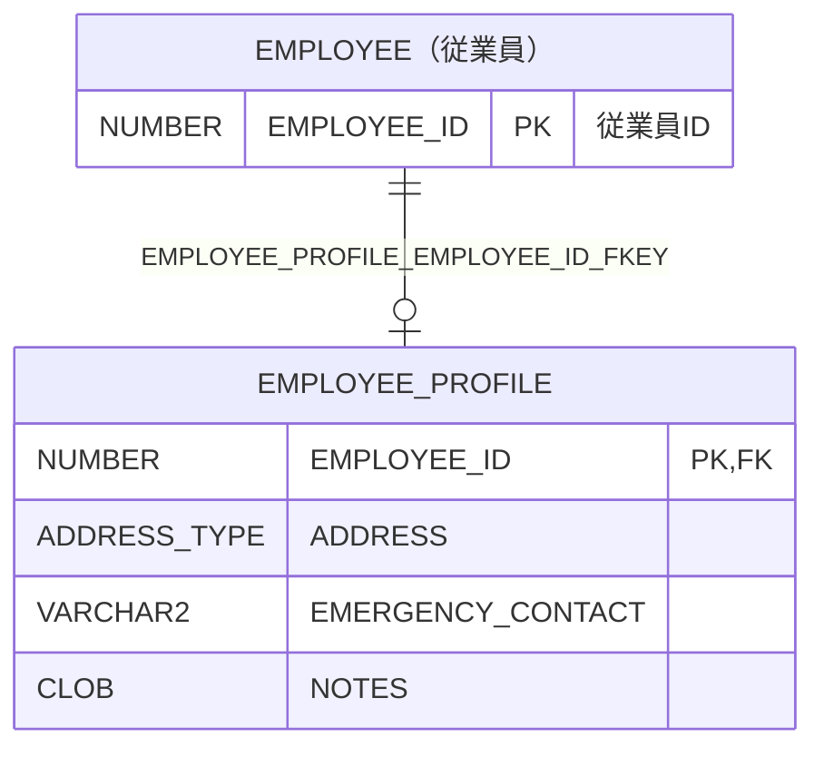

# EMPLOYEE_PROFILE

## 基本情報

| RDBMS | データベース名 | 作成日 |
|:---|:---|:---|
|Oracle 23|FREEPDB1|2026/10/08|

## テーブル説明

## テーブル情報

| スキーマ名 | 論理テーブル名 | 物理テーブル名 | 区分 | 備考 |
|:---|:---|:---|:---|:---|
|SAMPLE||EMPLOYEE_PROFILE|table||

## カラム情報

| No. | 論理名 | 物理名 | データ型 | 桁数/精度 | PK | Not Null | デフォルト | 備考 |
|:---|:---|:---|:---|:---|:---|:---|:---|:---|
|1||EMPLOYEE_ID|NUMBER(10,0)|10|○|○|||
|2||ADDRESS|ADDRESS_TYPE||||||
|3||EMERGENCY_CONTACT|VARCHAR2(50)|50|||||
|4||NOTES|CLOB||||||

## インデックス情報

| No. | インデックス名 | 種別 | UNIQUE | PRIMARY | 定義 | 備考 |
|:---|:---|:---|:---|:---|:---|:---|
|1|EMPLOYEE_PROFILE_PKEY|NORMAL|○|○|CREATE UNIQUE INDEX EMPLOYEE_PROFILE_PKEY ON EMPLOYEE_PROFILE (EMPLOYEE_ID)||

## 制約情報

| No. | 制約名 | 種類 | 制約定義 | 備考 |
|:---|:---|:---|:---|:---|
|1|EMPLOYEE_PROFILE_EMPLOYEE_ID_FKEY|FOREIGN KEY|FOREIGN KEY (EMPLOYEE_ID) REFERENCES EMPLOYEE(EMPLOYEE_ID)||
|2|EMPLOYEE_PROFILE_PKEY|PRIMARY KEY|PRIMARY KEY (EMPLOYEE_ID)||

## 外部キー情報

| No. | 外部キー名 | カラムリスト | 参照先 | 参照先カラムリスト | 多重度 |
|:---|:---|:---|:---|:---|:---|
|1|EMPLOYEE_PROFILE_EMPLOYEE_ID_FKEY|EMPLOYEE_ID|SAMPLE.EMPLOYEE|EMPLOYEE_ID|1対1|

## トリガー情報

| No. | トリガー名 | タイミング | イベント | 単位 | 定義 |
|:---|:---|:---|:---|:---|:---|

## ER図

___

[テーブル一覧へ](../../tableList_FREEPDB1.md)
