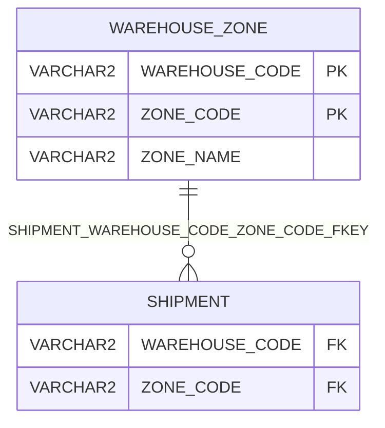

# WAREHOUSE_ZONE

## 基本情報

| RDBMS | データベース名 | 作成日 |
|:---|:---|:---|
|Oracle 23|FREEPDB1|2026/10/08|

## テーブル説明

## テーブル情報

| スキーマ名 | 論理テーブル名 | 物理テーブル名 | 区分 | 備考 |
|:---|:---|:---|:---|:---|
|SAMPLE||WAREHOUSE_ZONE|table||

## カラム情報

| No. | 論理名 | 物理名 | データ型 | 桁数/精度 | PK | Not Null | デフォルト | 備考 |
|:---|:---|:---|:---|:---|:---|:---|:---|:---|
|1||WAREHOUSE_CODE|VARCHAR2(5)|5|○|○|||
|2||ZONE_CODE|VARCHAR2(5)|5|○|○|||
|3||ZONE_NAME|VARCHAR2(50)|50||○|||

## インデックス情報

| No. | インデックス名 | 種別 | UNIQUE | PRIMARY | 定義 | 備考 |
|:---|:---|:---|:---|:---|:---|:---|
|1|WAREHOUSE_ZONE_PKEY|NORMAL|○|○|CREATE UNIQUE INDEX WAREHOUSE_ZONE_PKEY ON WAREHOUSE_ZONE (WAREHOUSE_CODE,ZONE_CODE)||

## 制約情報

| No. | 制約名 | 種類 | 制約定義 | 備考 |
|:---|:---|:---|:---|:---|
|1|WAREHOUSE_ZONE_PKEY|PRIMARY KEY|PRIMARY KEY (WAREHOUSE_CODE,ZONE_CODE)||

## 外部キー情報

| No. | 外部キー名 | カラムリスト | 参照先 | 参照先カラムリスト | 多重度 |
|:---|:---|:---|:---|:---|:---|

## 被参照情報

| No. | 参照元 | 参照元カラムリスト | 参照されるカラムリスト | 関連名 | 多重度 | 区分 |
|:---|:---|:---|:---|:---|:---|:---|
|1|SAMPLE.SHIPMENT|WAREHOUSE_CODE,ZONE_CODE|WAREHOUSE_CODE,ZONE_CODE|SHIPMENT_WAREHOUSE_CODE_ZONE_CODE_FKEY|1対多|物理|

## トリガー情報

| No. | トリガー名 | タイミング | イベント | 単位 | 定義 |
|:---|:---|:---|:---|:---|:---|

## ER図

___

[テーブル一覧へ](../../tableList_FREEPDB1.md)
