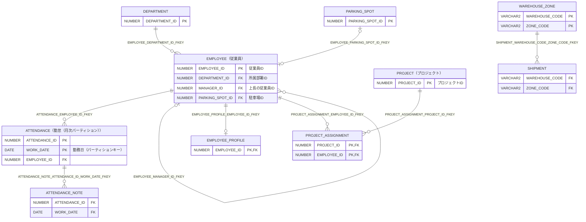

# ER図（DB名：FREEPDB1 / スキーマ名：SAMPLE）

## 基本情報

| RDBMS | データベース名 | 作成日 |
|:---|:---|:---|
|Oracle 23|FREEPDB1|2026/10/08|

## ER図

## ER図に掲載しているテーブル

| No. | スキーマ名 | 物理テーブル名 | 論理テーブル名 | 区分 | Link |
|:---|:---|:---|:---|:---|:---|
| 1 | SAMPLE | ATTENDANCE | 勤怠（月次パーティション） | table | [■](./SAMPLE/table/ATTENDANCE.md) |
| 2 | SAMPLE | ATTENDANCE_NOTE |  | table | [■](./SAMPLE/table/ATTENDANCE_NOTE.md) |
| 3 | SAMPLE | DEPARTMENT |  | table | [■](./SAMPLE/table/DEPARTMENT.md) |
| 4 | SAMPLE | EMPLOYEE | 従業員 | table | [■](./SAMPLE/table/EMPLOYEE.md) |
| 5 | SAMPLE | EMPLOYEE_PROFILE |  | table | [■](./SAMPLE/table/EMPLOYEE_PROFILE.md) |
| 6 | SAMPLE | PARKING_SPOT |  | table | [■](./SAMPLE/table/PARKING_SPOT.md) |
| 7 | SAMPLE | PROJECT | プロジェクト | table | [■](./SAMPLE/table/PROJECT.md) |
| 8 | SAMPLE | PROJECT_ASSIGNMENT |  | table | [■](./SAMPLE/table/PROJECT_ASSIGNMENT.md) |
| 9 | SAMPLE | SHIPMENT |  | table | [■](./SAMPLE/table/SHIPMENT.md) |
| 10 | SAMPLE | WAREHOUSE_ZONE |  | table | [■](./SAMPLE/table/WAREHOUSE_ZONE.md) |

___

[ER図一覧へ](./erDiagramList_FREEPDB1.md) / [テーブル一覧へ](./tableList_FREEPDB1.md)
