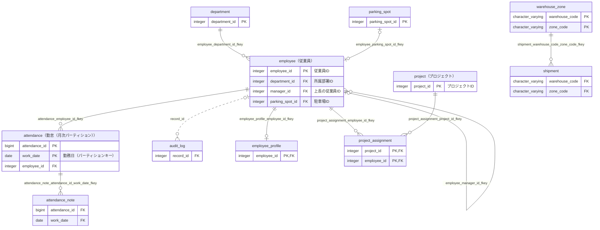

# ER図（DB名：testdb / スキーマ名：sample）

## 基本情報

| RDBMS | データベース名 | 作成日 |
|:---|:---|:---|
|PostgreSQL 16|testdb|2026/10/08|

## ER図

## ER図に掲載しているテーブル

| No. | スキーマ名 | 物理テーブル名 | 論理テーブル名 | 区分 | Link |
|:---|:---|:---|:---|:---|:---|
| 1 | sample | attendance | 勤怠（月次パーティション） | table | [■](./sample/table/attendance.md) |
| 2 | sample | attendance_note |  | table | [■](./sample/table/attendance_note.md) |
| 3 | sample | audit_log |  | table | [■](./sample/table/audit_log.md) |
| 4 | sample | department |  | table | [■](./sample/table/department.md) |
| 5 | sample | employee | 従業員 | table | [■](./sample/table/employee.md) |
| 6 | sample | employee_profile |  | table | [■](./sample/table/employee_profile.md) |
| 7 | sample | parking_spot |  | table | [■](./sample/table/parking_spot.md) |
| 8 | sample | project | プロジェクト | table | [■](./sample/table/project.md) |
| 9 | sample | project_assignment |  | table | [■](./sample/table/project_assignment.md) |
| 10 | sample | shipment |  | table | [■](./sample/table/shipment.md) |
| 11 | sample | warehouse_zone |  | table | [■](./sample/table/warehouse_zone.md) |

___

[ER図一覧へ](./erDiagramList_testdb.md) / [テーブル一覧へ](./tableList_testdb.md)
