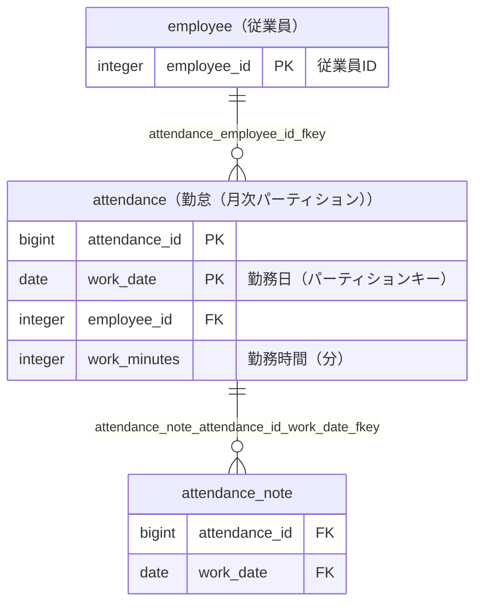

# attendance（勤怠（月次パーティション））

## 基本情報

| RDBMS | データベース名 | 作成日 |
|:---|:---|:---|
|PostgreSQL 16|testdb|2026/10/08|

## テーブル説明

## テーブル情報

| スキーマ名 | 論理テーブル名 | 物理テーブル名 | 区分 | 備考 |
|:---|:---|:---|:---|:---|
|sample|勤怠（月次パーティション）|attendance|table||

## カラム情報

| No. | 論理名 | 物理名 | データ型 | 桁数/精度 | PK | Not Null | デフォルト | 備考 |
|:---|:---|:---|:---|:---|:---|:---|:---|:---|
|1||attendance_id|bigint||○|○|||
|2|勤務日（パーティションキー）|work_date|date||○|○|||
|3||employee_id|integer|||○|||
|4|勤務時間（分）|work_minutes|integer||||||

## パーティション情報

パーティションキー: `RANGE (work_date)`

| No. | パーティション | 親 | パーティション境界 | 下位のパーティションキー |
|:---|:---|:---|:---|:---|
|1|sample_archive.attendance_2025|attendance|FOR VALUES FROM ('2025-01-01') TO ('2026-01-01')||
|2|attendance_2026_01|attendance|FOR VALUES FROM ('2026-01-01') TO ('2026-02-01')||
|3|attendance_2026_02|attendance|FOR VALUES FROM ('2026-02-01') TO ('2026-03-01')||
|4|attendance_2026_03|attendance|FOR VALUES FROM ('2026-03-01') TO ('2026-04-01')|RANGE (work_date)|
|5|attendance_2026_03_a|attendance_2026_03|FOR VALUES FROM ('2026-03-01') TO ('2026-03-16')||
|6|attendance_2026_03_b|attendance_2026_03|FOR VALUES FROM ('2026-03-16') TO ('2026-04-01')||
|7|attendance_default|attendance|DEFAULT||

## インデックス情報

| No. | インデックス名 | 種別 | UNIQUE | PRIMARY | 定義 | 備考 |
|:---|:---|:---|:---|:---|:---|:---|
|1|attendance_pkey|btree|○|○|CREATE UNIQUE INDEX attendance_pkey ON ONLY sample.attendance USING btree (attendance_id, work_date)||
|2|idx_attendance_employee|btree|||CREATE INDEX idx_attendance_employee ON ONLY sample.attendance USING btree (employee_id)||

## 制約情報

| No. | 制約名 | 種類 | 制約定義 | 備考 |
|:---|:---|:---|:---|:---|
|1|attendance_employee_id_fkey|FOREIGN KEY|FOREIGN KEY (employee_id) REFERENCES sample.employee(employee_id)||
|2|attendance_pkey|PRIMARY KEY|PRIMARY KEY (attendance_id, work_date)||

## 外部キー情報

| No. | 外部キー名 | カラムリスト | 参照先 | 参照先カラムリスト | 多重度 |
|:---|:---|:---|:---|:---|:---|
|1|attendance_employee_id_fkey|employee_id|sample.employee|employee_id|1対多|

## 被参照情報

| No. | 参照元 | 参照元カラムリスト | 参照されるカラムリスト | 関連名 | 多重度 | 区分 |
|:---|:---|:---|:---|:---|:---|:---|
|1|sample.attendance_note|attendance_id,work_date|attendance_id,work_date|attendance_note_attendance_id_work_date_fkey|1対多|物理|

## 参照しているビュー

| No. | 参照元 | 区分 |
|:---|:---|:---|
|1|sample.attendance_monthly_view|view|

## トリガー情報

| No. | トリガー名 | タイミング | イベント | 単位 | 定義 |
|:---|:---|:---|:---|:---|:---|
|1|trg_attendance_check_work_minutes|BEFORE|INSERT/UPDATE|ROW|CREATE TRIGGER trg_attendance_check_work_minutes BEFORE INSERT OR UPDATE ON sample.attendance FOR EACH ROW EXECUTE FUNCTION sample.check_work_minutes()|

## ER図

___

[テーブル一覧へ](../../tableList_testdb.md)
