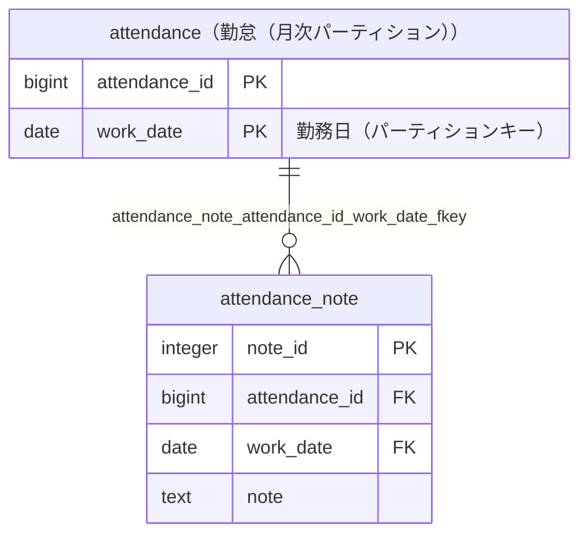

# attendance_note

## 基本情報

| RDBMS | データベース名 | 作成日 |
|:---|:---|:---|
|PostgreSQL 16|testdb|2026/10/08|

## テーブル説明

## テーブル情報

| スキーマ名 | 論理テーブル名 | 物理テーブル名 | 区分 | 備考 |
|:---|:---|:---|:---|:---|
|sample||attendance_note|table||

## カラム情報

| No. | 論理名 | 物理名 | データ型 | 桁数/精度 | PK | Not Null | デフォルト | 備考 |
|:---|:---|:---|:---|:---|:---|:---|:---|:---|
|1||note_id|integer||○|○|nextval('sample.attendance_note_note_id_seq'::regclass)||
|2||attendance_id|bigint|||○|||
|3||work_date|date|||○|||
|4||note|text||||||

## インデックス情報

| No. | インデックス名 | 種別 | UNIQUE | PRIMARY | 定義 | 備考 |
|:---|:---|:---|:---|:---|:---|:---|
|1|attendance_note_pkey|btree|○|○|CREATE UNIQUE INDEX attendance_note_pkey ON sample.attendance_note USING btree (note_id)||

## 制約情報

| No. | 制約名 | 種類 | 制約定義 | 備考 |
|:---|:---|:---|:---|:---|
|1|attendance_note_attendance_id_work_date_fkey|FOREIGN KEY|FOREIGN KEY (attendance_id, work_date) REFERENCES sample.attendance(attendance_id, work_date)||
|2|attendance_note_pkey|PRIMARY KEY|PRIMARY KEY (note_id)||

## 外部キー情報

| No. | 外部キー名 | カラムリスト | 参照先 | 参照先カラムリスト | 多重度 |
|:---|:---|:---|:---|:---|:---|
|1|attendance_note_attendance_id_work_date_fkey|attendance_id,work_date|sample.attendance|attendance_id,work_date|1対多|

## トリガー情報

| No. | トリガー名 | タイミング | イベント | 単位 | 定義 |
|:---|:---|:---|:---|:---|:---|

## ER図

___

[テーブル一覧へ](../../tableList_testdb.md)
