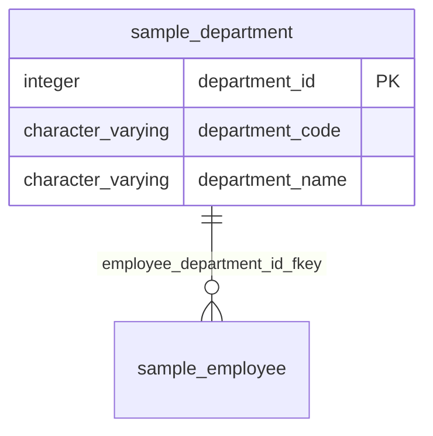

# department

## 基本情報

| RDBMS | データベース名 | 作成日 |
|:---|:---|:---|
|PostgreSQL|testdb|2026/09/26|

## テーブル説明

社内の組織単位を管理するマスタテーブル。
従業員（employee）は必ずいずれか1つの部署に所属する。

## テーブル情報

| スキーマ名 | 論理テーブル名 | 物理テーブル名 | 区分 | 備考 |
|:---|:---|:---|:---|:---|
|sample||department|table|組織改編時はdepartment_codeを変更せず、department_nameのみ更新すること|

## 所属する観点

* [人事管理](../../../viewpoint_testdb_personnel.md)  

## カラム情報

| No. | 論理名 | 物理名 | データ型 | 桁数/精度 | PK | Not Null | デフォルト | 備考 |
|:---|:---|:---|:---|:---|:---|:---|:---|:---|
|1||department_id|integer||○|○|nextval('sample.department_department_id_seq'::regclass)||
|2||department_code|character varying(10)|10||○||部署コード。他システム連携時のキーとして使用|
|3||department_name|character varying(50)|50||○||部署名称|

## インデックス情報

| No. | インデックス名 | 種別 | UNIQUE | PRIMARY | 定義 | 備考 |
|:---|:---|:---|:---|:---|:---|:---|
|1|department_department_code_key|btree|○||CREATE UNIQUE INDEX department_department_code_key ON sample.department USING btree (department_code)||
|2|department_pkey|btree|○|○|CREATE UNIQUE INDEX department_pkey ON sample.department USING btree (department_id)||

## 制約情報

| No. | 制約名 | 種類 | 制約定義 | 備考 |
|:---|:---|:---|:---|:---|
|1|department_pkey|PRIMARY KEY|PRIMARY KEY (department_id)||
|2|department_department_code_key|UNIQUE|UNIQUE (department_code)||

## 外部キー情報

| No. | 外部キー名 | カラムリスト | 参照先 | 参照先カラムリスト | 多重度 |
|:---|:---|:---|:---|:---|:---|

## トリガー情報

| No. | トリガー名 | タイミング | イベント | 単位 | 定義 |
|:---|:---|:---|:---|:---|:---|

## ER図

___

[テーブル一覧へ](../../../tableList_testdb.md)
