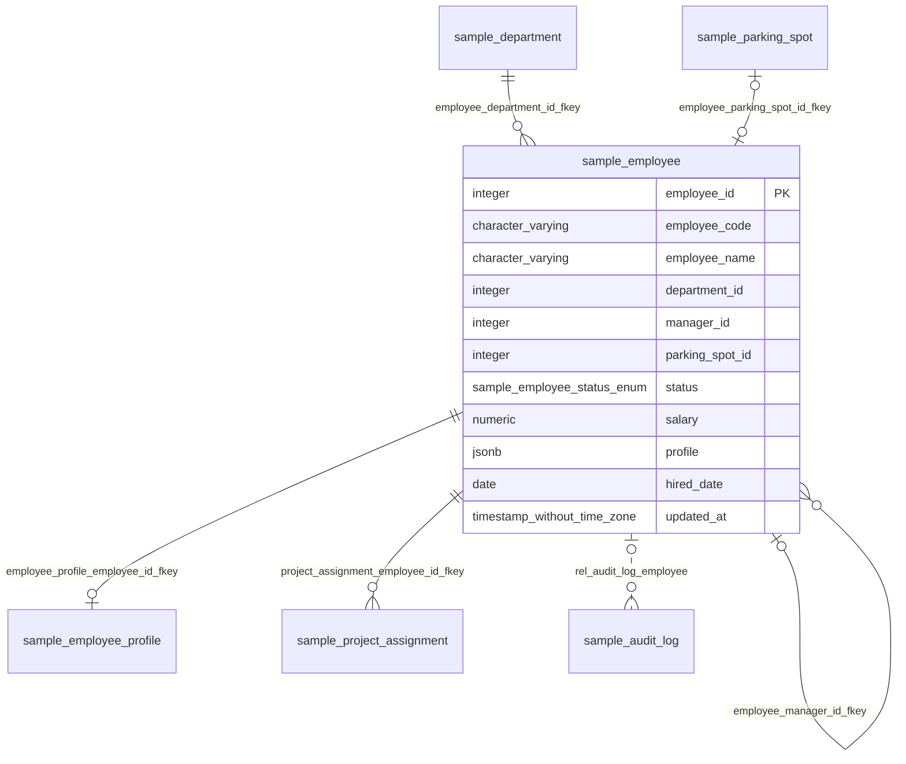

# employee（従業員）

## 基本情報

| RDBMS | データベース名 | 作成日 |
|:---|:---|:---|
|PostgreSQL|testdb|2026/09/26|

## テーブル説明

## テーブル情報

| スキーマ名 | 論理テーブル名 | 物理テーブル名 | 区分 | 備考 |
|:---|:---|:---|:---|:---|
|sample|従業員|employee|table||

## 所属する観点

* [人事管理](../../../viewpoint_testdb_personnel.md)  
* [プロジェクト管理](../../../viewpoint_testdb_project.md)  

## カラム情報

| No. | 論理名 | 物理名 | データ型 | 桁数/精度 | PK | Not Null | デフォルト | 備考 |
|:---|:---|:---|:---|:---|:---|:---|:---|:---|
|1|従業員ID|employee_id|integer||○|○|nextval('sample.employee_employee_id_seq'::regclass)||
|2|従業員コード|employee_code|character varying(10)|10||○|||
|3|従業員名|employee_name|character varying(50)|50||○|||
|4|所属部署ID|department_id|integer|||○|||
|5|上長の従業員ID|manager_id|integer||||||
|6|駐車場ID|parking_spot_id|integer||||||
|7|在籍状況|status|sample.employee_status_enum|||○|'ACTIVE'::sample.employee_status_enum||
|8|給与|salary|numeric(10,2)|10,2||○|0||
|9|プロフィール（JSON）|profile|jsonb|||○|'{}'::jsonb||
|10|入社日|hired_date|date|||○|CURRENT_DATE||
|11|更新日時|updated_at|timestamp without time zone|||○|now()||

## インデックス情報

| No. | インデックス名 | 種別 | UNIQUE | PRIMARY | 定義 | 備考 |
|:---|:---|:---|:---|:---|:---|:---|
|1|employee_employee_code_key|btree|○||CREATE UNIQUE INDEX employee_employee_code_key ON sample.employee USING btree (employee_code)||
|2|employee_parking_spot_id_key|btree|○||CREATE UNIQUE INDEX employee_parking_spot_id_key ON sample.employee USING btree (parking_spot_id)||
|3|employee_pkey|btree|○|○|CREATE UNIQUE INDEX employee_pkey ON sample.employee USING btree (employee_id)||
|4|idx_employee_department_status|btree|||CREATE INDEX idx_employee_department_status ON sample.employee USING btree (department_id, status)||
|5|idx_employee_profile_gin|gin|||CREATE INDEX idx_employee_profile_gin ON sample.employee USING gin (profile)||

## 制約情報

| No. | 制約名 | 種類 | 制約定義 | 備考 |
|:---|:---|:---|:---|:---|
|1|employee_salary_check|CHECK|CHECK ((salary >= (0)::numeric))||
|2|employee_department_id_fkey|FOREIGN KEY|FOREIGN KEY (department_id) REFERENCES sample.department(department_id)||
|3|employee_manager_id_fkey|FOREIGN KEY|FOREIGN KEY (manager_id) REFERENCES sample.employee(employee_id)||
|4|employee_parking_spot_id_fkey|FOREIGN KEY|FOREIGN KEY (parking_spot_id) REFERENCES sample.parking_spot(parking_spot_id)||
|5|employee_pkey|PRIMARY KEY|PRIMARY KEY (employee_id)||
|6|employee_employee_code_key|UNIQUE|UNIQUE (employee_code)||
|7|employee_parking_spot_id_key|UNIQUE|UNIQUE (parking_spot_id)||

## 外部キー情報

| No. | 外部キー名 | カラムリスト | 参照先 | 参照先カラムリスト | 多重度 |
|:---|:---|:---|:---|:---|:---|
|1|employee_department_id_fkey|department_id|sample.department|department_id|1対多|
|2|employee_manager_id_fkey|manager_id|sample.employee|employee_id|0..1対多|
|3|employee_parking_spot_id_fkey|parking_spot_id|sample.parking_spot|parking_spot_id|0..1対1|

## トリガー情報

| No. | トリガー名 | タイミング | イベント | 単位 | 定義 |
|:---|:---|:---|:---|:---|:---|
|1|trg_employee_audit|AFTER|INSERT/DELETE/UPDATE|ROW|CREATE TRIGGER trg_employee_audit AFTER INSERT OR DELETE OR UPDATE ON sample.employee FOR EACH ROW EXECUTE FUNCTION sample.log_employee_change()|
|2|trg_employee_set_updated_at|BEFORE|UPDATE|ROW|CREATE TRIGGER trg_employee_set_updated_at BEFORE UPDATE ON sample.employee FOR EACH ROW EXECUTE FUNCTION sample.set_updated_at()|

## ER図

___

[テーブル一覧へ](../../../tableList_testdb.md)
