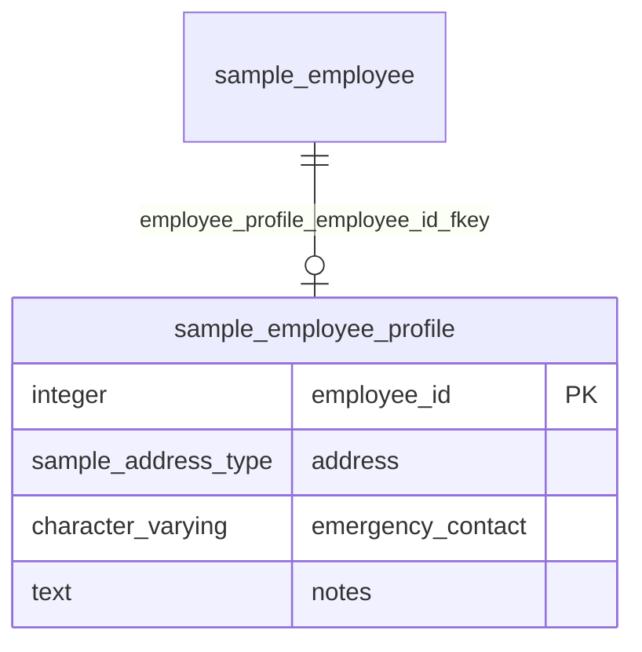

# employee_profile

## 基本情報

| RDBMS | データベース名 | 作成日 |
|:---|:---|:---|
|PostgreSQL|testdb|2026/09/26|

## テーブル説明

## テーブル情報

| スキーマ名 | 論理テーブル名 | 物理テーブル名 | 区分 | 備考 |
|:---|:---|:---|:---|:---|
|sample||employee_profile|table||

## 所属する観点

* [人事管理](../../../viewpoint_testdb_personnel.md)  

## カラム情報

| No. | 論理名 | 物理名 | データ型 | 桁数/精度 | PK | Not Null | デフォルト | 備考 |
|:---|:---|:---|:---|:---|:---|:---|:---|:---|
|1||employee_id|integer||○|○|||
|2||address|sample.address_type||||||
|3||emergency_contact|character varying(50)|50|||||
|4||notes|text||||||

## インデックス情報

| No. | インデックス名 | 種別 | UNIQUE | PRIMARY | 定義 | 備考 |
|:---|:---|:---|:---|:---|:---|:---|
|1|employee_profile_pkey|btree|○|○|CREATE UNIQUE INDEX employee_profile_pkey ON sample.employee_profile USING btree (employee_id)||

## 制約情報

| No. | 制約名 | 種類 | 制約定義 | 備考 |
|:---|:---|:---|:---|:---|
|1|employee_profile_employee_id_fkey|FOREIGN KEY|FOREIGN KEY (employee_id) REFERENCES sample.employee(employee_id)||
|2|employee_profile_pkey|PRIMARY KEY|PRIMARY KEY (employee_id)||

## 外部キー情報

| No. | 外部キー名 | カラムリスト | 参照先 | 参照先カラムリスト | 多重度 |
|:---|:---|:---|:---|:---|:---|
|1|employee_profile_employee_id_fkey|employee_id|sample.employee|employee_id|1対1|

## トリガー情報

| No. | トリガー名 | タイミング | イベント | 単位 | 定義 |
|:---|:---|:---|:---|:---|:---|

## ER図

___

[テーブル一覧へ](../../../tableList_testdb.md)
