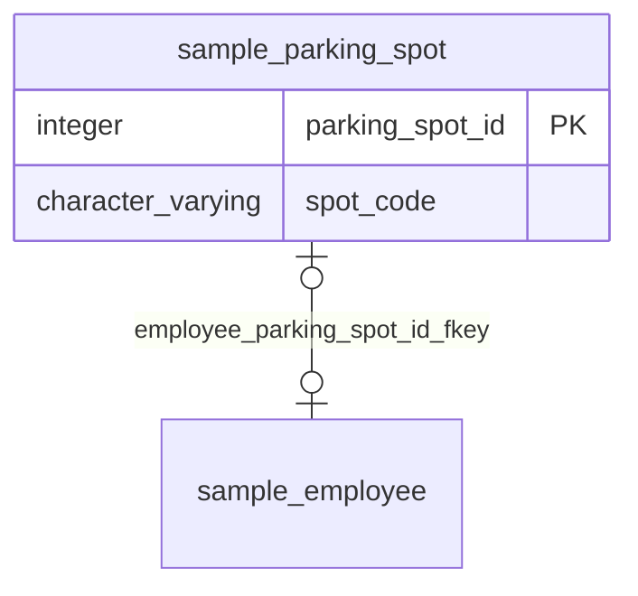

# parking_spot

## 基本情報

| RDBMS | データベース名 | 作成日 |
|:---|:---|:---|
|PostgreSQL|testdb|2026/09/26|

## テーブル説明

## テーブル情報

| スキーマ名 | 論理テーブル名 | 物理テーブル名 | 区分 | 備考 |
|:---|:---|:---|:---|:---|
|sample||parking_spot|table||

## 所属する観点

* [人事管理](../../../viewpoint_testdb_personnel.md)  

## カラム情報

| No. | 論理名 | 物理名 | データ型 | 桁数/精度 | PK | Not Null | デフォルト | 備考 |
|:---|:---|:---|:---|:---|:---|:---|:---|:---|
|1||parking_spot_id|integer||○|○|nextval('sample.parking_spot_parking_spot_id_seq'::regclass)||
|2||spot_code|character varying(10)|10||○|||

## インデックス情報

| No. | インデックス名 | 種別 | UNIQUE | PRIMARY | 定義 | 備考 |
|:---|:---|:---|:---|:---|:---|:---|
|1|parking_spot_pkey|btree|○|○|CREATE UNIQUE INDEX parking_spot_pkey ON sample.parking_spot USING btree (parking_spot_id)||
|2|parking_spot_spot_code_key|btree|○||CREATE UNIQUE INDEX parking_spot_spot_code_key ON sample.parking_spot USING btree (spot_code)||

## 制約情報

| No. | 制約名 | 種類 | 制約定義 | 備考 |
|:---|:---|:---|:---|:---|
|1|parking_spot_pkey|PRIMARY KEY|PRIMARY KEY (parking_spot_id)||
|2|parking_spot_spot_code_key|UNIQUE|UNIQUE (spot_code)||

## 外部キー情報

| No. | 外部キー名 | カラムリスト | 参照先 | 参照先カラムリスト | 多重度 |
|:---|:---|:---|:---|:---|:---|

## トリガー情報

| No. | トリガー名 | タイミング | イベント | 単位 | 定義 |
|:---|:---|:---|:---|:---|:---|

## ER図

___

[テーブル一覧へ](../../../tableList_testdb.md)
