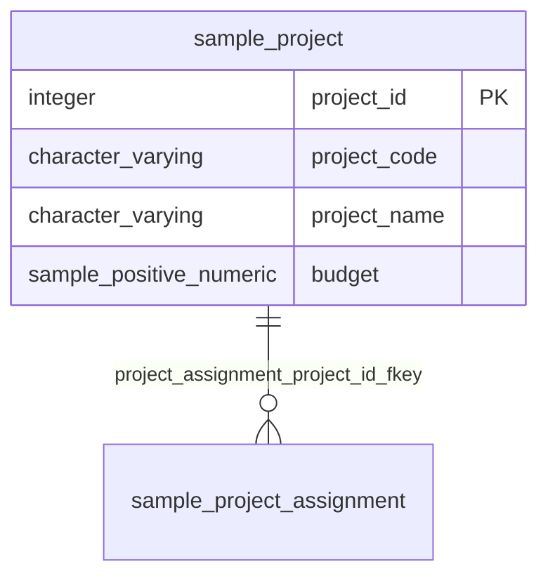

# project（プロジェクト）

## 基本情報

| RDBMS | データベース名 | 作成日 |
|:---|:---|:---|
|PostgreSQL|testdb|2026/09/26|

## テーブル説明

## テーブル情報

| スキーマ名 | 論理テーブル名 | 物理テーブル名 | 区分 | 備考 |
|:---|:---|:---|:---|:---|
|sample|プロジェクト|project|table||

## カラム情報

| No. | 論理名 | 物理名 | データ型 | 桁数/精度 | PK | Not Null | デフォルト | 備考 |
|:---|:---|:---|:---|:---|:---|:---|:---|:---|
|1|プロジェクトID|project_id|integer||○|○|nextval('sample.project_project_id_seq'::regclass)||
|2|プロジェクトコード|project_code|character varying(10)|10||○|||
|3|プロジェクト名|project_name|character varying(100)|100||○|||
|4|予算|budget|sample.positive_numeric||||||

## インデックス情報

| No. | インデックス名 | 種別 | UNIQUE | PRIMARY | 定義 | 備考 |
|:---|:---|:---|:---|:---|:---|:---|
|1|project_pkey|btree|○|○|CREATE UNIQUE INDEX project_pkey ON sample.project USING btree (project_id)||
|2|project_project_code_key|btree|○||CREATE UNIQUE INDEX project_project_code_key ON sample.project USING btree (project_code)||

## 制約情報

| No. | 制約名 | 種類 | 制約定義 | 備考 |
|:---|:---|:---|:---|:---|
|1|project_pkey|PRIMARY KEY|PRIMARY KEY (project_id)||
|2|project_project_code_key|UNIQUE|UNIQUE (project_code)||

## 外部キー情報

| No. | 外部キー名 | カラムリスト | 参照先 | 参照先カラムリスト | 多重度 |
|:---|:---|:---|:---|:---|:---|

## トリガー情報

| No. | トリガー名 | タイミング | イベント | 単位 | 定義 |
|:---|:---|:---|:---|:---|:---|

## ER図

___

[テーブル一覧へ](../../../tableList_testdb.md)
