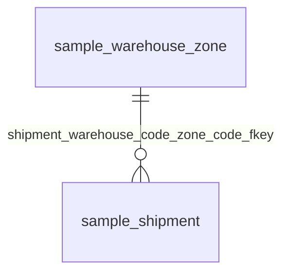

# 観点：物流（DB名：testdb）

## 基本情報

| RDBMS | データベース名 | 作成日 |
|:---|:---|:---|
|PostgreSQL|testdb|2026/09/26|

## ER図

## 所属テーブル

| No. | スキーマ名 | 物理テーブル名 | 論理テーブル名 | 区分 | Link |
|:---|:---|:---|:---|:---|:---|
| 1 | sample | shipment |  | table | [■](./testdb/sample/table/shipment.md) |
| 2 | sample | warehouse_zone |  | table | [■](./testdb/sample/table/warehouse_zone.md) |

___

[観点一覧へ](./viewpointList_testdb.md) [テーブル一覧へ](./tableList_testdb.md)
