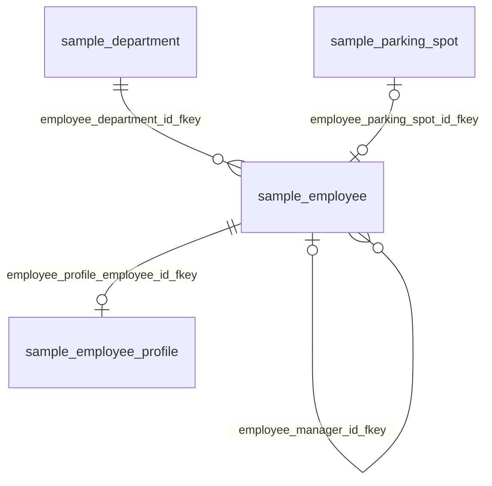

# 観点：人事管理（DB名：testdb）

## 基本情報

| RDBMS | データベース名 | 作成日 |
|:---|:---|:---|
|PostgreSQL|testdb|2026/09/26|

## 説明

従業員と、その所属・付帯情報を扱うテーブル群。
プロジェクトへのアサインは「プロジェクト管理」の観点を参照。

## ER図

## 所属テーブル

| No. | スキーマ名 | 物理テーブル名 | 論理テーブル名 | 区分 | Link |
|:---|:---|:---|:---|:---|:---|
| 1 | sample | department |  | table | [■](./testdb/sample/table/department.md) |
| 2 | sample | employee | 従業員 | table | [■](./testdb/sample/table/employee.md) |
| 3 | sample | employee_profile |  | table | [■](./testdb/sample/table/employee_profile.md) |
| 4 | sample | parking_spot |  | table | [■](./testdb/sample/table/parking_spot.md) |

## 観点外のテーブルとの関連

| No. | 参照元 | 外部キー名 | 参照先 |
|:---|:---|:---|:---|
| 1 | sample.project_assignment | project_assignment_employee_id_fkey | sample.employee |
| 2 | sample.audit_log | rel_audit_log_employee | sample.employee |

___

[観点一覧へ](./viewpointList_testdb.md) [テーブル一覧へ](./tableList_testdb.md)
