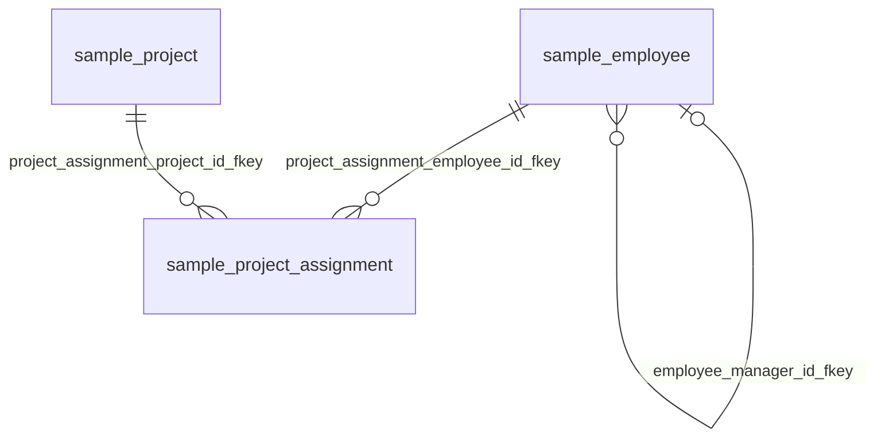

# 観点：プロジェクト管理（DB名：testdb）

## 基本情報

| RDBMS | データベース名 | 作成日 |
|:---|:---|:---|
|PostgreSQL|testdb|2026/09/26|

## 説明

プロジェクトと要員のアサインを扱うテーブル群。

## ER図

## 所属テーブル

| No. | スキーマ名 | 物理テーブル名 | 論理テーブル名 | 区分 | Link |
|:---|:---|:---|:---|:---|:---|
| 1 | sample | employee | 従業員 | table | [■](./testdb/sample/table/employee.md) |
| 2 | sample | project | プロジェクト | table | [■](./testdb/sample/table/project.md) |
| 3 | sample | project_assignment |  | table | [■](./testdb/sample/table/project_assignment.md) |
| 4 | sample | project_summary_mv | プロジェクト別要員数集計 | materialized_view | [■](./testdb/sample/materialized_view/project_summary_mv.md) |

## 観点外のテーブルとの関連

| No. | 参照元 | 外部キー名 | 参照先 |
|:---|:---|:---|:---|
| 1 | sample.employee | employee_department_id_fkey | sample.department |
| 2 | sample.employee | employee_parking_spot_id_fkey | sample.parking_spot |
| 3 | sample.employee_profile | employee_profile_employee_id_fkey | sample.employee |
| 4 | sample.audit_log | rel_audit_log_employee | sample.employee |

___

[観点一覧へ](./viewpointList_testdb.md) [テーブル一覧へ](./tableList_testdb.md)
