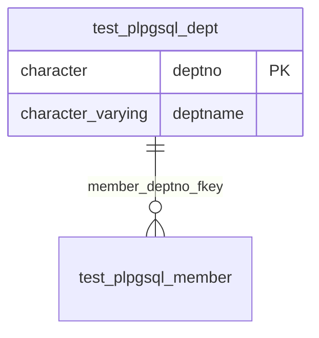

# dept

## 基本情報

| RDBMS | データベース名 | 作成日 |
|:---|:---|:---|
|PostgreSQL|testdb|2026/09/21|

## テーブル説明

## テーブル情報

| スキーマ名 | 論理テーブル名 | 物理テーブル名 | 区分 | 備考 |
|:---|:---|:---|:---|:---|
|test_plpgsql||dept|table||

## カラム情報

| No. | 論理名 | 物理名 | データ型 | 桁数/精度 | PK | Not Null | デフォルト | 備考 |
|:---|:---|:---|:---|:---|:---|:---|:---|:---|
|1||deptno|character(5)|5|○|○| ||
|2||deptname|character varying(40)|40||○| ||

## インデックス情報

| No. | インデックス名 | 種別 | UNIQUE | PRIMARY | 定義 | 備考 |
|:---|:---|:---|:---|:---|:---|:---|
|1|dept_deptname_key|btree|○||CREATE UNIQUE INDEX dept_deptname_key ON test_plpgsql.dept USING btree (deptname)||
|2|dept_deptno_deptname_idx|btree|||CREATE INDEX dept_deptno_deptname_idx ON test_plpgsql.dept USING btree (deptno, deptname)||
|3|dept_pkey|btree|○|○|CREATE UNIQUE INDEX dept_pkey ON test_plpgsql.dept USING btree (deptno)||

## 制約情報

| No. | 制約名 | 種類 | 制約定義 | 備考 |
|:---|:---|:---|:---|:---|
|1|dept_pkey|PRIMARY KEY|PRIMARY KEY (deptno)||
|2|dept_deptname_key|UNIQUE|UNIQUE (deptname)||

## 外部キー情報

| No. | 外部キー名 | カラムリスト | 参照先 | 参照先カラムリスト |
|:---|:---|:---|:---|:---|

## ER図

___

[テーブル一覧へ](../../../tableList_testdb.md)
